

    

  English
  | 
  <a href="docs/readme/readme_ZH.md">简体中文</a>
  | 
  <a href="docs/readme/readme_TW.md">繁體中文</a>
  | 
  <a href="docs/readme/readme_ja.md">日本語</a>

# What is Bika.ai？ - Business AI Agents Platform Starter Guide

> This article is a beginner's guide to the Business AI Agents Platform [Bika.ai](https://bika.ai)
>
> [Bika.ai](https://bika.ai) is Business AI Agent platform that proactively helps everyone complete work, process reports, and data collection daily.
>
> Free up your work time, escape the hassle of tedious tasks, and truly enjoy more time living your life.

## What is Bika.ai?

    

 

Bika.ai is a Business AI Agents platform that combines no-code, billion-row spreadsheet-database, form, wiki notes, automation workflow to streamline work. There's no need for constant chatting with AI. Bika.ai automates repetitive tasks and seamlessly executes across functions like marketing and sales, allowing you to focus on strategic work.

In traditional AI tools, you need to actively engage in conversation with AI to get work done. Bika.ai, however, is a Proactive AI Agent that proactively reminds and distributes tasks. You don't need to communicate with it directly; instead, it automates tasks on a schedule to help you or your team complete various jobs.

### Use Cases

Bika.ai can be used for:

- **Marketing Automation**: Automatically send marketing content such as emails, YouTube videos, Twitter tweets, and SMS notifications in bulk, on schedule, and at intervals, achieving fast and efficient marketing automation.
- **Lead Management**: Automatically collect, track, and manage millions of sales leads, helping you systematically follow up with potential customers and improve sales conversion rates.
- **AI Reporting to You**: Regularly suggests AI strategies and automation processes to you, and only executes them after your decision. AI will also generate regular reports for you.
- **All-in-one Solution**: No need for complex professional software. Bika.ai’s lightweight AI automation database can meet your needs for customer data storage, management, and tracking.
- **Custom Editing**: Bika.ai provides a powerful low-code/no-code editor, allowing you to easily customize various automation task processes and data systems, enabling project management, support tickets, order management, and more application scenarios.

### Highlights Features

Plug-and-Play Automation Template: Quickly automate your workflows with AI in just a 3-minute, step-by-step setup, easy to custom.

- **Proactive AI Automation**: AI proactively manages daily tasks, generates timely reminders, and creates comprehensive AI reports, all without manual prompts.
- **Automation Publish and Sharing**: Easily publish, share, and discover automation processes, enhancing collaboration and efficiency across teams.
- **Big Data Visual Database**: Supports billions of rows, API operations, and dashboard charts, enabling extensive analysis and data-driven decisions.

    

Bika is perfect for automating daily marketing routines, such as bulk social media posting and bulk email auto-sending, this tool makes complex configurations a thing of the past.

Crucially, Bika.ai is truly plug-and-play, offering many ready-to-use templates that let you set up AI automation workflows suited to your business in just 3 minutes.

    <a href="https://bika.ai" target="_blank">
        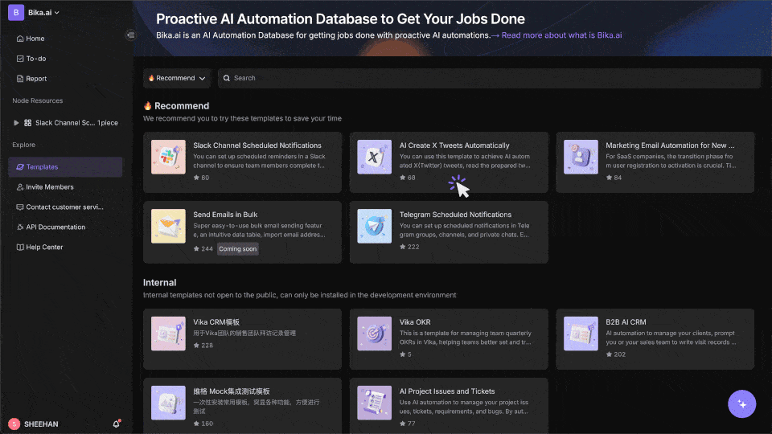
    </a>

 

Bika.ai's Proactive AI Automation proactively takes the helm, managing daily tasks and generating reminders and comprehensive AI reports automatically.

It keeps your team in the loop with upcoming tasks and project updates without any manual input, ensuring nothing falls through the cracks.

Enhance your team's productivity and project management with AI that's always two steps ahead.

 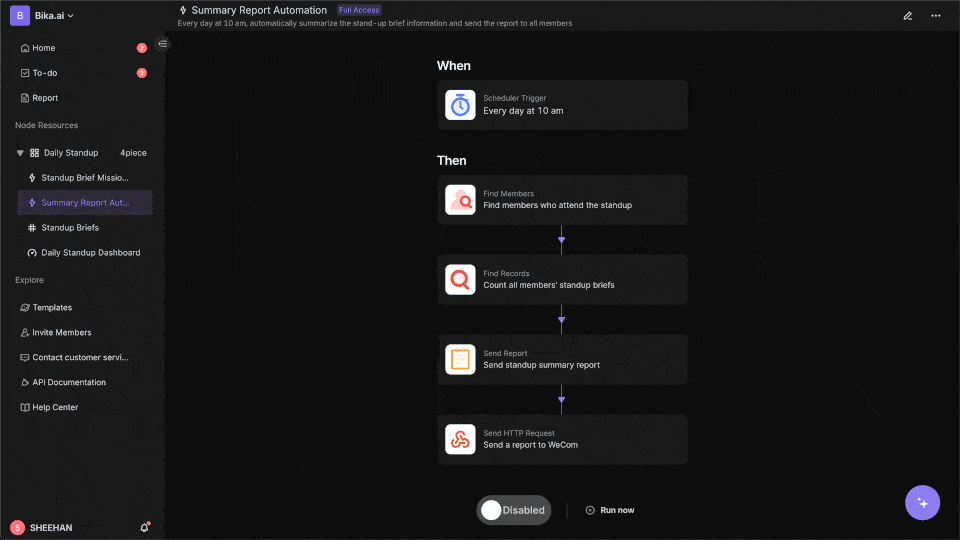

Unlike most automation tools, Bika.ai allows you to publish and share your configured automations, enabling effortless collaboration across teams.

Spread effective project management automations across departments to unify and elevate operational efficiency.

This tool not only boosts transparency but also streamlines workflows, making team efficiency the norm, not the exception.

 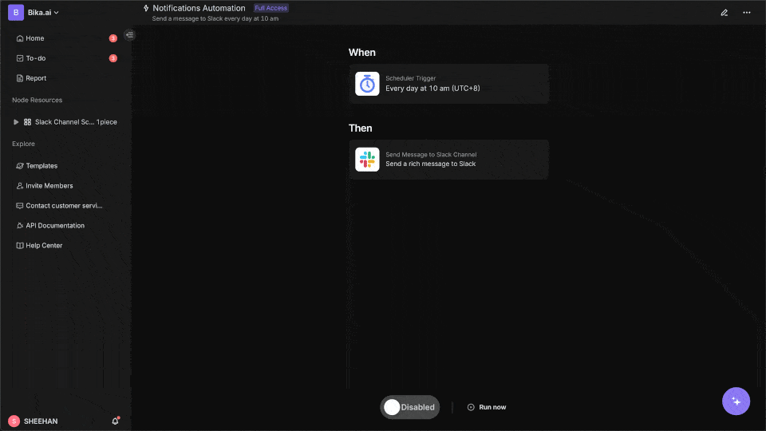

AI automation will dramatically increase your data volume, but don't worry—Bika.ai's Big Data Visual Database makes it easy to handle billions of rows and support API operations.

Store endless customer data and leverage advanced dashboard charts for insightful, data-driven decisions that propel your business forward.

Dive into data with ease, thanks to intuitive visualizations that help you decode complex information at a glance.

 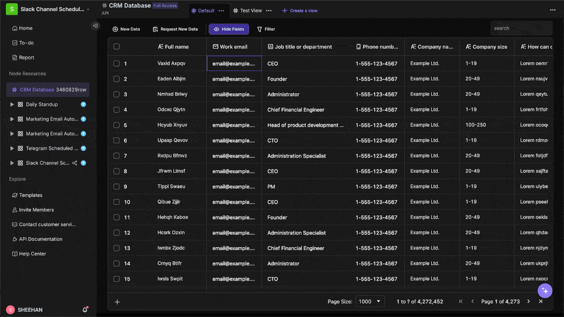

 

## Quick Start with Bika.ai, Begin AI Automation

    

 

Let's quickly get started with Bika.ai and see how you can learn new AI automation skills in just 3 minutes, freeing up your time for the future.

1. Sign up at [Bika.ai](https://bika.ai/signup).
2. Go to "Template Center" on the left.
3. Install the "Slack Channel Scheduled Notifications" template.
4. Create a Slack app to obtain a Webhook URL.
5. Enter the Webhook URL into the Webhook Source in the template.
6. Test the automation by clicking "Run now."
7. Adjust the content and timing of the auto-sending message.
8. Confirm settings with another "Run now."
9. Enable automation by switching to ON.

Below is a brief introduction to the principles.

 

## What Bika.ai can be used for?

Bika.ai is a Business AI Agents platform for building intelligent data management system such as AI-Agent-enahnced CRM, marketing automation system, project management system, BI and ERP, all at an amazing price.It is best for:

- Marketers and content creators
- Influencers
- Automation consultants
- Project managers
- Sales managers

Here are various use cases of Bika.ai:

### 📣 Marketing

For marketers and influencers, automating daily marketing routines such as bulk social media posting with Bika.ai helps exponentially amplify your influence.

### 💼 Sales

In sales, you can set up bulk email auto-sending in just 3 minutes to effortlessly reach your customers, and the Big Data Visual Database supports billions of rows, allowing you to store as much customer data as you need.

### 📋 Project Management

For project managers, Proactive AI Automation can automatically remind team members of upcoming tasks and provide detailed reports on project statuses, ensuring even complex project management is well-organized.

### 🏠 Daily Life

Automation apps and templates for your daily life.

### 💰 Finance

Investors and financial analysts can streamline their decision-making process by utilizing tools for automated stock data retrieval and accessing real-time market updates.

### 📁 Operation

Operational personnel can significantly boost efficiency by automating key tasks such as recruitment processes and invoice management, which simplifies data collection and streamlines processing.

## Dive Deeper into Bika.ai: How AI Automatically Completes Tasks?

After getting a quick start, you'll find that using Bika.ai is incredibly simple. Just select the appropriate AI template, and you can easily complete various tasks and make further adjustments.

    <a href="https://www.youtube.com/watch?v=8ZJXN9uFfL0" target="_blank">
        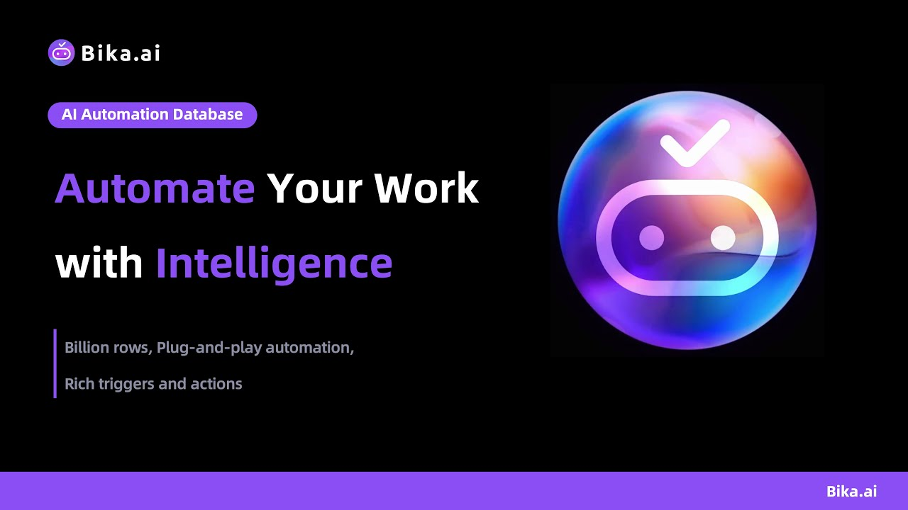
    </a>

 

Let's open the main UI and delve into Bika.ai to understand its core components and how it achieves automation.

 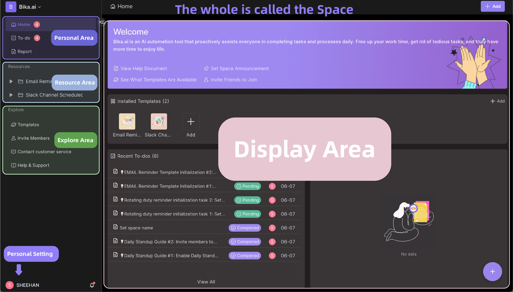

### Space

The space is the first interface you see when you enter Bika.ai. It encompasses all your work, consisting of personal areas, resource areas, exploration areas, display areas, personal settings, and space management.

 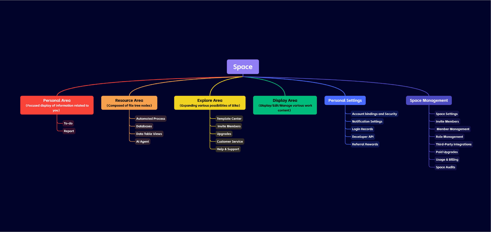

A space can have multiple members, each with their own personal zones and multiple resources.

### Personal Area

In the personal area, you can see your personal homepage, tasks, and reports. The homepage is an overview of your work, let's take a look at "My Tasks" and "Reports".

#### Mission

In Bika.ai, "Mission" is a AI automatically generates task mechanism. 

Mission is a hybrid of approval, task, request, review, alignment, and confirmation.

You can use mission for such as to-do task reminder, request other users do something, data collection, seeking your decisions, report review, workflow approval, and confirm AI-generated drafts.

 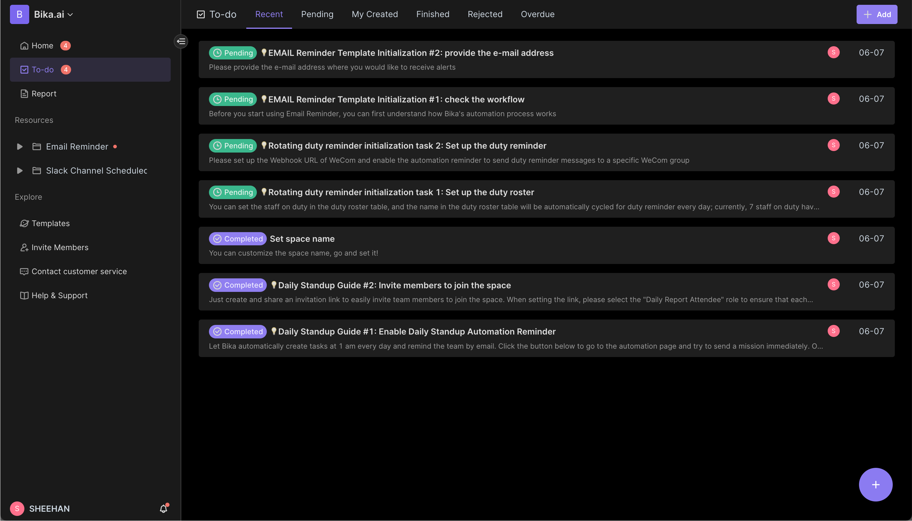

Note, the "mission" in Bika.ai are different from "tasks" in typical to-do software, where users manually create and complete tasks.

In Bika.ai, missions are usually generated by AI or Automation, which also auto-determines their completion. 

For example, in the scenario of "Daily Sales Report", the AI will automatically generate a mission for each sales member. 

Once the members submit the form and the data record verified by the AI, this mission will be automatically completed.

#### Report

"Report" is generated by AI or automation based on predefined rules or data records, similar to an email, article, or document.

 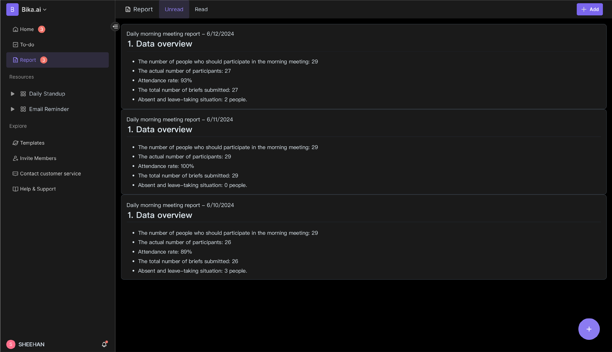

For example, as a sales manager, a daily customer report is automatically generated and submitted to you by AI, which is deeply integrated into the process but still obedient to your commands.

### Resource Area

You will notice when installing templates that a template consists of multiple resources. For example, the "AI Create X Tweets Automatically" template consists of two resources:

- Automation resources: Schedule Tweets

- Database resource: Tweet Content

 

### Explore Area

The explore area allows you to expand the possibilities with Bika, including template center, invite members, upgrades, customer service, and help & support. The template center offers a variety of AI automation templates that let you quickly solve work challenges.

 

### Display Area

Here, you can display and edit your tasks, reports, and resource nodes, making it easy to understand and manage your work content.

 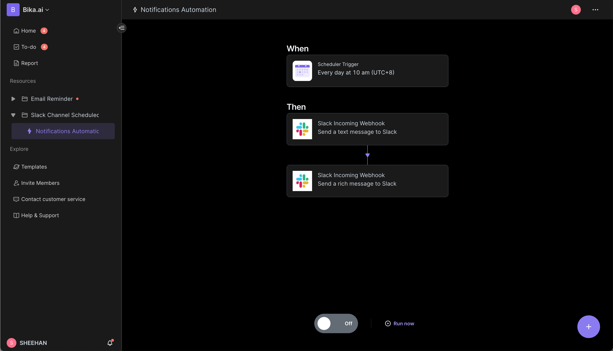

### Personal Settings

Click on the avatar in the lower left corner -> Personal Settings, you can see your personal information, account bindings and security, notification settings, login records, developer API, and referral rewards.

 

### Space Management

Click on the space in the upper left corner -> gear icon, you can manage and set up the space, including space settings, invite members, member management, role management, third-party integrations, paid upgrades, usage & billing, and space audits.

 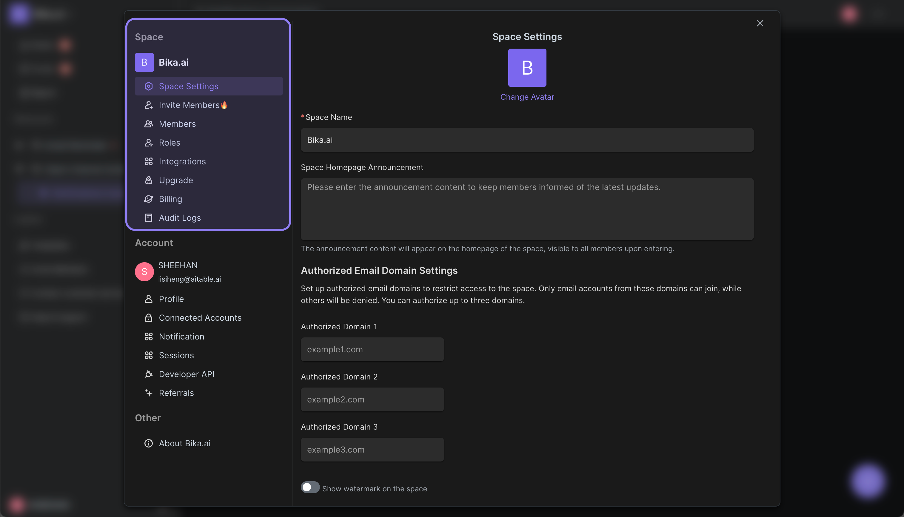

    

 

## Features

### Language

Bika.ai supports system languages below:

- English
- Simplified Chinese
- Traditional Chinese
- Japanese

Not only the system languages, the data apps includes database, fields, automation inside also support multi languages. What it means that if you can build your own custom ai data automations app to others that support multi languages depends on your users region.

### Node Resource

Node Resource is a type of node implementaion like database, automation, form, document etc.

### Automation - Triggers

An automation trigger acts as the "switch" that initiates an automation when specific conditions are met. Consider a Trigger as: When a specific event occurs (the Trigger) and certain conditions hold true, then the resulting event (the Action) takes place.

### Automation - Actions

An automation action refers to a step that carries out a task, activity, event, or change, such as sending an email. You can think of an action like this: When something occurs (the trigger) and the specified conditions are met, then this event (the action) takes place.

### Mission

Mission is a smart, automative, traceable tasks differs from typical tasks or to-do lists, which you have to check off by yourself. For example, consider the Create Record Mission: when a user receives it, the mission will automatically be marked as complete only when the required record has been created.

### Database - View

A database view provides a specific way to visualize and arrange the underlying data in a database. The standard view is a grid, but other formats include forms, calendars, galleries, and kanban layouts. A single database can support multiple views and various types of views.

### Database - Fields

Database fields contain details or metadata for each record in a database. Database fields hold information or metadata for each entry in a database. These fields can take various forms, allowing data to be stored as text, single or multiple selections, images, checkboxes, numbers, user tags, and more.

### Dashboard - Widgets

Widgets are used to display data in a visual and interactive way.

### Integrations

Integrations are connections between Bika.ai and external services or applications that enable seamless data transfer between both platforms. The choice of integration you select will ultimately depend on the specific problem you aim to address with your data. For instance, if you have a database records that tracks tasks and you want to utilize AI for summarization, you can leverage the OpenAI integration to send the data to OpenAI, and then use the returned information to send emails.

### Product Comparison

Bika.ai mixes Airtable (database) and Zapier (automation) into an incredible easy-to-use platform for building data-critical Business AI Agents such as CRM, marketing automation system, project management system, BI and ERP, all at an amazing price.

- [airtable](https://airtable.com/): Compare to Airtable, Bika.ai is more focused on AI automation and proactive assistance. Bika.ai is more suitable for users who need more automation and AI assistance in their work and life.
- [zapier](https://zapier.com/): Compare to Zapier, Bika.ai is more focused on out-of-box templates and database workflow. Bika.ai is more suitable for users who need more automation and AI assistance in their work and life.
- [make](https://www.make.com/): Compared to Make, Bika.ai provides more integrated AI-driven solutions and proactive automation directly within its platform. Bika.ai is ideal for users seeking deep automation with advanced AI capabilities to streamline complex workflows and data management tasks.

### More Features

Overall, Bika.ai offers a range of proactive and automated novel functions, suitable for both individuals and businesses.

- Space: Space is your personal or team workspace, where each Space can have multiple members, each with multiple tasks, reports, resources, AI Agents, etc.
- Resources: Resources are objects that can be operated on automatically by AI, including:
  - Automated Processes: Set up scheduling and triggering events to automate certain tasks.
  - Datasheets: Similar to multidimensional tables or database tables, these are structured tables that support billions of data rows.
  - Views: Independent representations of data from datasheets, such as grid views, gallery views, mind map views, kanban views, full-feature grid views, and calendar views.
- Task: Unlike the "personal tasks" you're familiar with, these are tasks generated automatically by AI, with AI automatically assessing their completion.
- Report: Summaries and reports generated automatically or by AI.
- Datasheet:
  - `Large Data Volume`: Multidimensional tables supporting billions of data rows, suitable for large data volume chart creation and AI data training.
  - `Rich API`: Full-stack OpenAPI access from `data` to `metadata`, using Bika.ai as if it were a business database like PostgreSQL, MySQL, etc.
  - `Linking`: Unidirectional/bidirectional table linking and `infinite cross-linking`.
  - `CRUD`: Create, browse, update, and delete tables, columns, and rows.
  - `AI Search`: Perform AI search and question-answering across the entire data tables, views, and knowledge bases, transforming them into a productivity knowledge base.
  - `Personalized Toolbar`: User-specific toolbar actions like filtering and grouping are independent and do not affect other users.
  - `Field Operations`: Sorting, filtering, grouping, hide/unhide, and height setting.
  - `Based on Space`: Uses separated workspaces instead of App/Base structures, making infinite table connections possible.
  - `Dark Mode` and theme customization.
  - `7 Types of Views`: Datasheet (Grid) / Gallery View / Mind Map View / Kanban View / Full-Feature Grid View / Calendar View.
- Templates: Truly one-stop templates that bundle automation, third-party integrations, datasheets, and organizational roles together for one-click installation and use;
  - `Upgrade Templates`: Installed templates can follow official upgrades or be fine-tuned lightly by users.
  - `Publish Templates`: One-stop, full-stack templates can be published externally and even sold, with protected intellectual property; templates do not lose control rights after installation.
- Personal, Team, and Enterprise Structure Management:
- Multilingual: Default support for English, Simplified Chinese, Traditional Chinese, and Japanese, seamlessly supporting international team collaboration, with more languages welcome.
- Enterprise-Level Permissions:
  - `Permissions`: Supports personal, team, and enterprise-level permissions, including row, column, and folder permissions.
  - `Independent Resource Views`, transforming views into mirrors to achieve advanced permission segregation.
  - `Activate Column Permissions` with straightforward operations.
  - `Folder/Sub-folder/File Permissions`
  - `Tree Structure Folders` and Customizable Resources (Node Files)
  - `Team Management & Organizational Structure`
  - Support whitelabel and self-hosting.
- Future Enhancements:
  - `AI Voice`: Fully intelligent.
  - `AI Creation`:
  - `Terraform Resource Control`
  - `Integration` with n8n.io, Zapier, make.com, Appsmith, and more
  - `Single Sign-On (SSO)/SAML` and other authentications
  - `Custom Extensions and Plugins`
  - `Auditing`
  - `Database Auto Backup/Export`
  - `Security Watermarks`
  - `Slack, Teams, WhatsApp, Telegram, DingTalk, Wecom, Feishu Integrations`
- ....

## Completely Free Trial

    

 

Currently, Bika.ai is completely free to use with very generous usage limits. You can refer to the free specifications for details, see our [pricing page](https://bika.ai/pricing).

If you have ideas and want to suggest some features, please join our community to give feedback and make suggestions: https://bika.ai/contact-service

If you have further needs such as private deployment or feature scheduling, please contact our [senior management](https://bika.ai/blog/what-is-bika-ai?m=eyJuYW1lIjoiQ09OVEFDVF9TRVJWSUNFIn0=).

## Frequently Asked Questions: What is Bika.ai?

### Quick one-sentence introduction: What is Bika.ai?
Bika.ai is an AI automation tool that optimizes data management and task processing by combining tabular databases and AI technology, helping you execute workflows more efficiently.

 

### What make Bika.ai so unique?
Bika.ai offers an plug-and-play automation database with built-in automations and many integration options. It handles big data databases, up to billions of entries, effortlessly. You won’t need to constantly chat with the AI, and data volume is no longer a concern.

Bika.ai saves time by doing tasks automatically and making work more accurate. Users can effortlessly publish, share, and replicate automation templates, making it easy to keep improving. Bika.ai is an ideal solution for businesses wanting to simplify marketing, sales, project management operations and enhance data handling through AI automation.

 

### The English abbreviation "BIKA" stands for what meaning?
B-I-K-A.ai stands for Business Intelligence and Knowledge Automation with AI.

 

### How does Bika.ai automate tasks with AI?
Bika.ai starts with 'automation', not a 'chatbot', by setting automations and some triggering conditions, such as scheduling and new data addition, to automate tasks. In fact, Bika.ai is an 'AI automation tool', not an 'AI assistant'. It uses automation features without relying on large AI models, meaning it does not consume AI inference costs. With Bika.ai's core components like tasks, summaries, and resources, many tasks can be efficiently completed, saving you time and allowing you to enjoy life more. Visit the [Template Center](https://bika.ai/en/template) to find solutions that suit you.

 

### Is Bika.AI free to use?
Yes, Bika.AI is currently completely free to use, and the allowances are very generous. You can refer to the free specifications. If you exceed the free tier, or if you want to enjoy customized features, private deployment, and other services, you can [contact sales](https://bika.ai/en/blog/what-is-bika-ai?contact=1).

 

### What is the difference between Bika.ai and AI assistants like ChatGPT, Gemini?
ChatGPT, Gemini, Claude, and other AI assistants are based on large-model AI chatbots, requiring a substantial AI inference cost. Whereas Bika.ai is an AI automation and database tool that automates tasks. Both are completely different products; you might want to browse the AI automation template center to see if there are templates that meet your daily needs [Templates](https://bika.ai/en/template).

 

### What is the difference between Bika.ai and spreadsheet database?
There are many excellent spreadsheet database tools on the market, such as [AITable.ai](https://aitable.ai/), [Airtable](https://airtable.com/), etc. Indeed, the core of Bika.ai is similar to spreadsheets database: tabular databases, automation, etc. spreadsheet database excel in collaboration, but Bika.ai is focused on 'tasks', 'reporting', and 'AI automation', not primarily on spreadsheet database. Bika.ai aims to be an AI automation tool that fully utilizes data.

 

### Does Bika.ai get poor performance when the single database records reaches tens of thousands or hundreds of thousands of rows and the associations become more complex?
No, it does not. Bika.ai's data tables are architected and designed to handle massive data volumes. The underlying infrastructure combines technologies from OLTP business databases, OLAP analytics databases, NoSQL databases, time series databases, vector databases and index databases to ensure that performance remains fast and responsive even at the millions or billions of rows scale.

 

### What is the 'Space' in Bika.AI?
'Space' is a collaboration platform for all members of your organization or team. By clicking on the space icon in the top left corner of the Bika.ai space, you can access your personalized management and invited spaces.

 

### How many paid spaces do I own after making a payment?
Bika.ai operates on a space subscription model. When you purchase a subscription, you gain access to a space. The number of spaces you own is equivalent to the number of subscriptions you have purchased. Each space includes specific usage rights as outlined in your purchase terms.

 

### What does 'Resources' mean?
'Resources' refers to the file nodes in the directory tree on the left side of your space resources section, such as automations, databases, forms, dashboards, etc. Deleted resources are not counted. Creating a new database and a new form will add two file nodes to your count. Deleting one of these items will reduce the count by one.

 

### How does the Bika.ai team 'eat your own dog food' (use their own product)?
That's a great question, we are very passionate about using Bika.ai internally. Internally, we use Bika.ai for: daily standup notifications/collection/summarization, weekly scrum iteration notifications/collection/summarization, scheduling Twitter public account article approvals and posts, daily sales data analysis report generation, automated feature request and bug management, periodic marketing email dispatches, and more - trying to automate as many repetitive, routine tasks as possible with AI. The Bika.ai team runs 3 SaaS platform products, over 30 deployments, millions of users, and tens of thousands of team customers, and we desperately need a more AI-automated tool to reduce our own repetitive work, which is why we developed Bika.ai in the first place. We hope our customers can use Bika.ai in a 'use and go' fashion - just get in, set it up, and then let the AI automate most of the work going forward.

 

### How does Bika.ai help improve work efficiency?
Bika.ai helps users automate routine tasks through its powerful automation features. Users can set up automation tasks according to their needs, such as data update notifications, task scheduling, and automatic report generation, thereby reducing manual operations and increasing work efficiency. You can directly visit the [Template Center](https://bika.ai/en/template) to find solutions that suit you.

 

### What are the features of Bika.ai's AI automation?
Bika.ai's AI automation features allow users to create condition-based tasks that can be automatically triggered when certain conditions are met. For example, when a data table receives new data, Bika.ai can automatically process and analyze the data, and even send notifications to relevant personnel. Visit the [Template Center](https://bika.ai/en/template) to experience it.

 

### What are the automation templates in Bika.ai?
Automation templates are pre-set task workflows that users can directly apply to automate specific work processes within 3 minutes. These templates cover a wide range of common scenarios from data entry to complex data processing, allowing users to quickly deploy and leverage AI technology. It is recommended to visit the [Template Center](https://bika.ai/en/template) to use them.

 

### Does Bika.ai support team collaboration and permissions features?
Yes, Bika.ai provides the 'Space' feature, a team collaboration platform that not only allows internal team members to share resources, manage data, and collaborate, but also supports collaboration with external teams or individuals well. Spaces support personalized settings and permission management to ensure efficient team collaboration.

    

