

    <a href="https://bika.ai" target="_blank">
        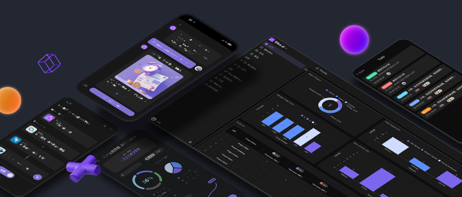
    </a>

  English
  | 
  <a href="Docs/readme/readme_ZH.md">简体中文</a>
  | 
  <a href="Docs/readme/readme_TW.md">繁體中文</a>
  | 
  <a href="Docs/readme/readme_ja.md">日本語</a>

# What is Bika.ai？ - Self-Motivated AI Automation Platform Starter Guide

> This article is a beginner's guide to the Self-Motivated AI Automation Platform [Bika.ai](https://bika.ai)
>
> [Bika.ai](https://bika.ai) is an AI automation application building platform that proactively helps everyone complete work, process reports, and data collection daily.
>
> Free up your work time, escape the hassle of tedious tasks, and truly enjoy more time living your life.

## What is Bika.ai?

In traditional AI tools, you need to actively engage in conversation with AI to get work done.

Bika.ai, however, is a Self-Motivated AI Agent that proactively reminds and distributes tasks. You don't need to communicate with it directly; instead, it automates tasks on a schedule to help you or your team complete various jobs.

    <a href="https://bika.ai/auth?redirect=%2Fspace" target="_blank">
        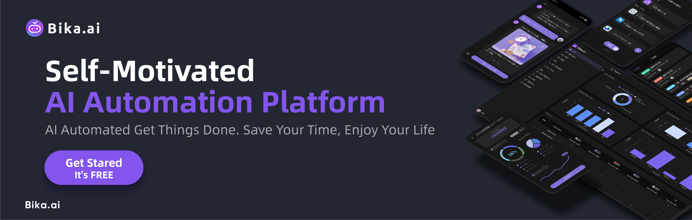
    </a>

 

Bika.ai offers:

- **Intelligent Tasks**: AI autonomously creates, assigns, and evaluates the completion of tasks without human prompting, such as daily accounting, daily diaries, team tasks, morning meeting inputs, and quarterly OKR reviews.

- **AI Reports**: AI generates reports based on your activities or tasks, such as weekly diary summaries, financial analyses, sales weekly reports, attendance statistics, etc.

- **Data Visualization**: AI automatically generates tasks, delegates data collection, supports multi-dimensional tables with billions of rows, and creates charts based on your data, such as sales, customer growth, team performance, and census data.

- **Intelligent Reminders**: Thoughtfully reminds you of every anniversary and important event, such as friends' birthdays, customer gift-giving, sales visits, and performance tracking.

- **Voice Input**: Talk to Bika to convert your voice into structured data, like quick notes of inspiration, customer visit entries, life diaries, and team CRM.

 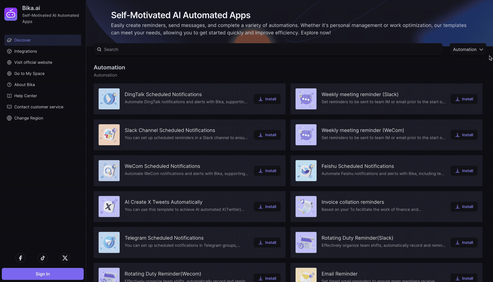

> Bika.ai's Template Center comes pre-loaded with a multitude of Self-motivated AI Automation Templates

 

## Quick Start with Bika.ai, Begin AI Automation

 

Let's quickly get started with Bika.ai and see how you can learn new AI automation skills in just 4 minutes, freeing up your time for the future.

1. Sign up at [Bika.ai](https://bika.ai/signup).
2. Go to "Template Center" on the left.
3. Install the "Slack Channel Scheduled Notifications" template.
4. Create a Slack app to obtain a Webhook URL.
5. Enter the Webhook URL into the Webhook Source in the template.
6. Test the automation by clicking "Run now."
7. Adjust the content and timing of the auto-sending message.
8. Confirm settings with another "Run now."
9. Enable automation by switching to ON.

Below is a brief introduction to the principles.

 

## Dive Deeper into Bika.ai: How AI Automatically Completes Tasks?

After getting a quick start, you'll find that using Bika.ai is incredibly simple. Just select the appropriate AI template, and you can easily complete various tasks and make further adjustments.

Let's open the main UI and delve into Bika.ai to understand its core components and how it achieves automation.

 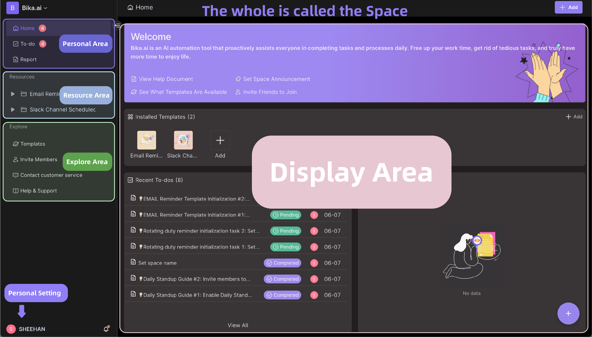

### Space

The space is the first interface you see when you enter Bika.ai. It encompasses all your work, consisting of personal areas, resource areas, exploration areas, display areas, personal settings, and space management.

 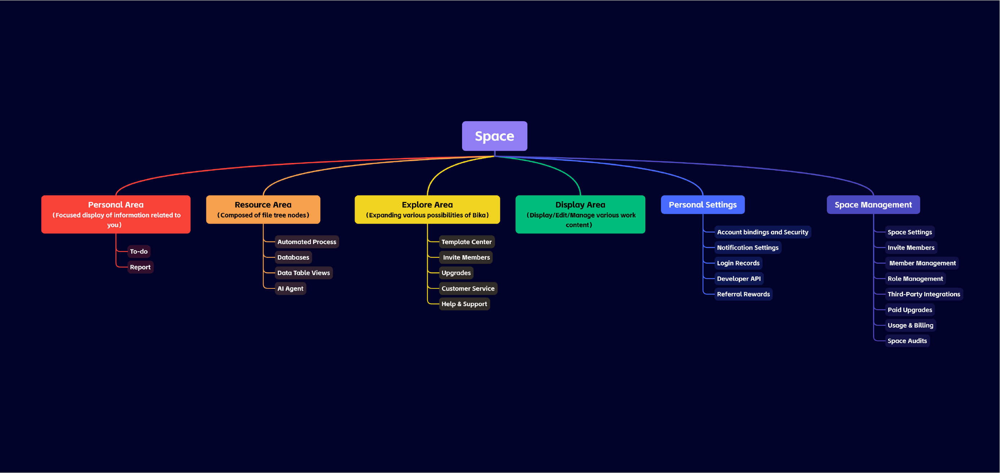

A space can have multiple members, each with their own personal zones and multiple resources.

### Personal Area

In the personal area, you can see your personal homepage, tasks, and reports. The homepage is an overview of your work, let's take a look at "My Tasks" and "Reports".

#### To-do

In Bika.ai, AI automatically generates tasks such as data collection, report reading, data entry, and approval of AI-generated drafts.

 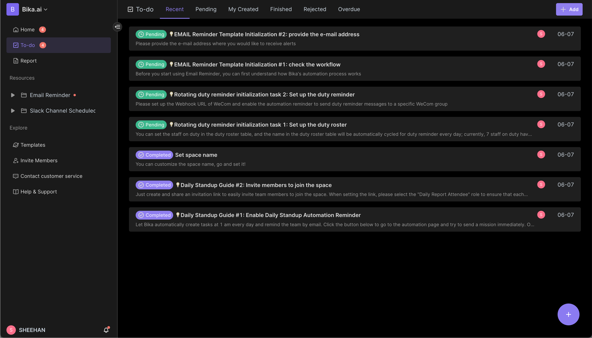

Note, the "tasks" in Bika.ai are different from tasks in typical to-do software, where users manually create and complete tasks.

In Bika.ai, tasks are auto-generated by AI, which also auto-determines their completion. For example, in the "Daily Morning Meeting Template" (link), AI automatically generates tasks for each member, achieving fully automated task management. This method reduces manual operations and enhances efficiency.

#### Report

Report are generated based on set rules or data, automated by AI, similar to an email or article.

 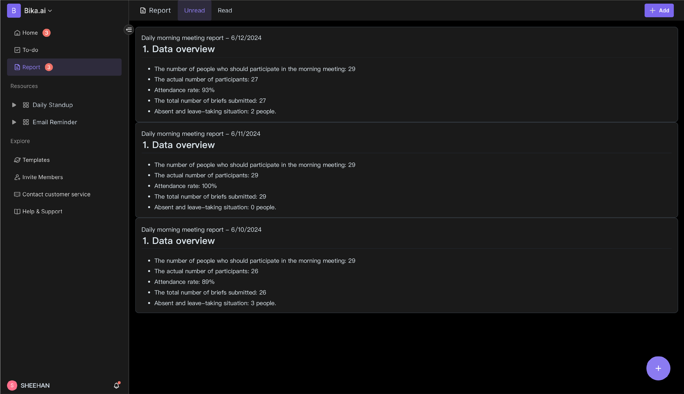

### Resource Area

You will notice when installing templates that a template consists of multiple resources. For example, the 'Slack Channel Scheduled Notifications' template consists of one resource:

- Automated Process: Scheduled to do something.

 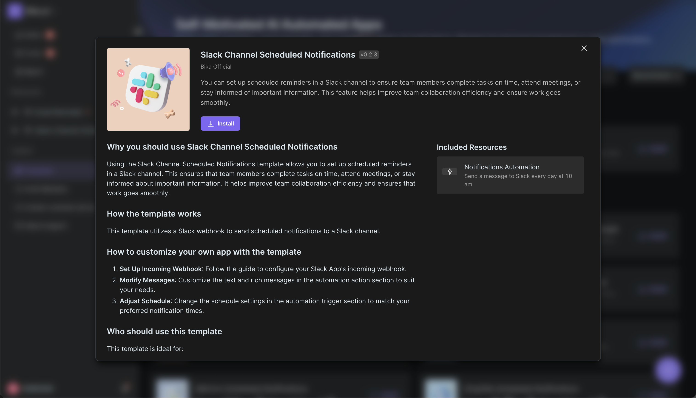

Additionally, resources can include databases (multidimensional tables), which can utilize AI automation for powerful data visualization.

### Explore Area

The explore area allows you to expand the possibilities with Bika, including template center, invite members, upgrades, customer service, and help & support. The template center offers a variety of AI automation templates that let you quickly solve work challenges.

 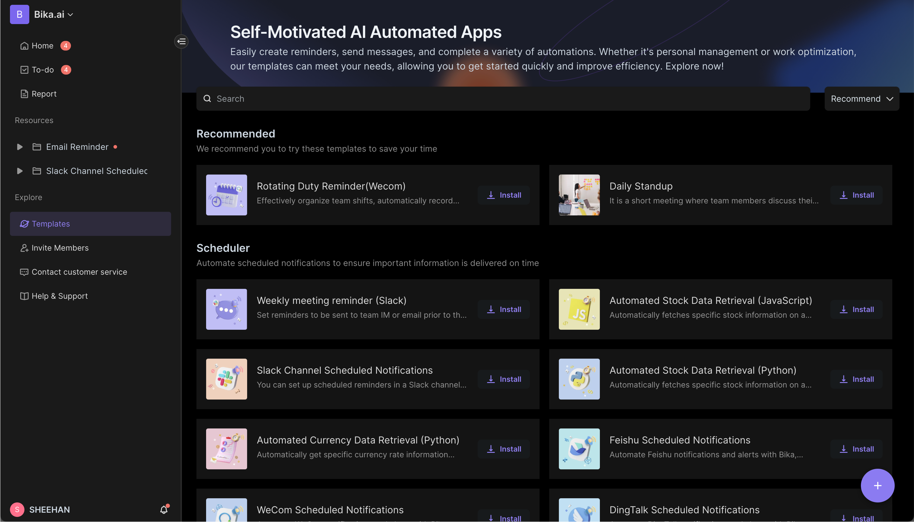

### Display Area

Here, you can display and edit your tasks, reports, and resource nodes, making it easy to understand and manage your work content.

 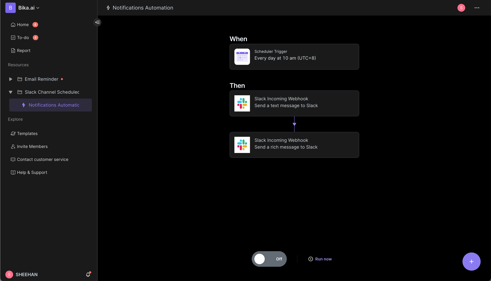

### Personal Settings

Click on the avatar in the lower left corner -> Personal Settings, you can see your personal information, account bindings and security, notification settings, login records, developer API, and referral rewards.

 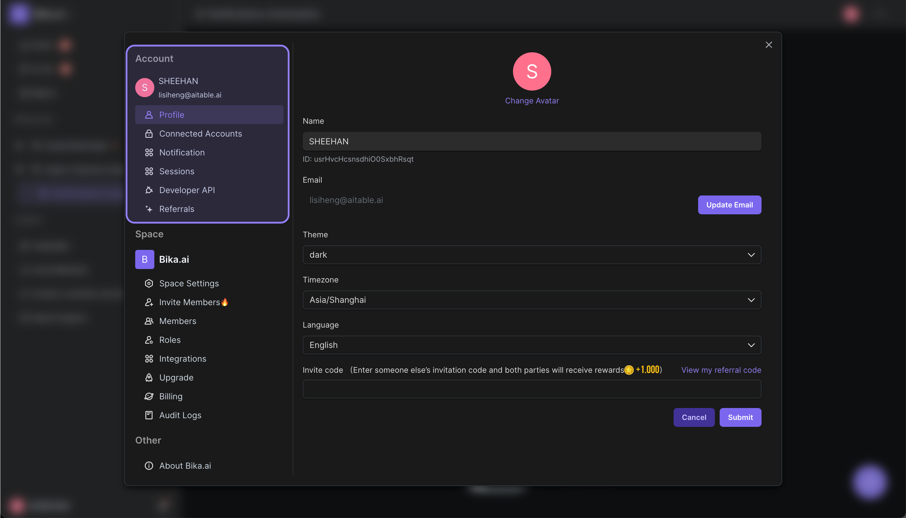

### Space Management

Click on the space in the upper left corner -> gear icon, you can manage and set up the space, including space settings, invite members, member management, role management, third-party integrations, paid upgrades, usage & billing, and space audits.

 

    

 

## What is Bika.ai?

Bika.ai is a Self-Motivated AI Tool that combines AI reasoning, automation, data tables, tasks, and more. It helps people automate many tasks in decision-centric scenarios without needing to interact with AI directly.

### Scheduled Notifications, Messages, Emails

Set specific times or trigger events to automatically send messages, emails, notifications, AI summaries, AI tasks, etc. For example, notifying people about daily morning meetings, daily reminders, daily reports, monthly data collections.

Reference templates:

- [Email Reminder](https://bika.ai/en/template/email-reminder) 
- [Slack Channel Scheduled Notifications](https://bika.ai/en/template/slack-ai-automated-remind) 
- [Invoice collation reminders](https://bika.ai/en/template/invoice-org-ai-automated-remind) 
- [Rotating Duty Reminder(Slack)](https://bika.ai/en/template/rotating-duty-reminder-slack) 

 

### AI Automation for Timely Web Scrapting and Content Creation

Set rules or data for AI or automation to fetch from third-party websites or data, then summarized by large AI models to generate emails, articles, content, videos, and pictures.

Imagine having an in-house content creator, data collector, and competitor analyst working 24/7, 365 days a year to gather market information and dynamics for you, delivering a report every day.

Reference templates:

- [Automated Stock Data Retrieval (Python)](https://bika.ai/en/template/automated-get-stock-info-py) 
- [Automated Currency Data Retrieval (Python)](https://bika.ai/en/template/automated-get-currency-info-py) 
- [Automated Currency Data Retrieval (JavaScript)](https://bika.ai/en/template/automated-get-currency-info-js) 
- [Automated Stock Data Retrieval (JavaScript)](https://bika.ai/en/template/automated-get-stock-info-js) 

 

### AI Automation for Task Generation and Data Collection

Generate tasks through AI automation, delegating people to collect data. The generated multidimensional tables support billions of data rows and can generate charts based on your data, such as sales, customer growth, team performance, and census data.

For instance, Bika.ai transforms into an AI-driven CRM customer management system with the help of AI automation.

Reference template:

- B2B AI CRM: Automate sales ops - automatically follow up and remind sales representatives of their visit records, and automatically summarize them, to facilitate the weekly sales meeting.

- [Daily Standup](https://bika.ai/en/template/@vika/scrum-standup) 
- [Vika OKR](https://bika.ai/en/template/@vika/okr) 

 

## Who is Bika.ai suitable for?

Especially suitable for the following people:

### Personal Life Assistant & Personal Work Assistant

In everyone's life, there are many regular and complex affairs to handle. If you had an AI assistant to help or remind you, it would be great.
With Bika.ai, AI can automatically remind you to keep accounts daily, keep a daily diary, pay utility bills, and more personal life and work scenarios.

### CEO & Business Owners

CEOs or business owners lead teams daily and deal with numerous trivial matters, not an easy task.

Business owners using Bika.ai can be seen as hiring an 'AI team,' a 'assistant' that works tirelessly 24 hours a day, 365 days a year to help you complete various tasks, such as daily task tracking, daily morning reports, daily data collection, data summarization, copywriting, report generation, sales data collection, sales task assignment, sales performance tracking, customer visits, sales reporting, sales data collection, sales task assignment, sales performance tracking, market trend capturing, and more.

Reference templates:

- [Daily Standup](https://bika.ai/en/template/@vika/scrum-standup) 
- [Vika OKR](https://bika.ai/en/template/@vika/okr) 

 

### Sales Managers & Project Managers

Sales managers face many management challenges every day, such as how to urge sales staff to make customer visits, assign sales tasks, track sales performance, effectively remember customer history, order details, and efficiently collect sales data and generate sales reports.

Sales and project managers, using Bika.ai, are like hiring an 'AI assistant' that tirelessly urges you to fill visit records, keep up with customer dynamics, assign sales tasks, track sales performance, generate sales reports, collect sales data, assign sales tasks, track sales performance, capture market trends, and more.

Reference templates:

- B2B AI CRM: Automate sales ops - automatically follow up and remind sales representatives of their visit records, and automatically summarize them, to facilitate the weekly sales meeting.

- [Email Reminder](https://bika.ai/en/template/email-reminder) 

 

### Marketers & Content Operators

Content creators spend much less time creating content than you might think; most of their time is spent on menial tasks like brainstorming, choosing topics, drafting, planning, formatting, publishing, and promoting.
Using Bika.ai, AI automatically captures news highlights or market dynamics daily, providing you with creative inspiration and materials, and even regularly auto-publishes, automates the generation of some content, articles, reports. You only need to fine-tune, approve, and publish.

Reference templates:

- [Automated Stock Data Retrieval (Python)](https://bika.ai/en/template/automated-get-stock-info-py) 
- [Automated Currency Data Retrieval (Python)](https://bika.ai/en/template/automated-get-currency-info-py) 
- [Automated Currency Data Retrieval (JavaScript)](https://bika.ai/en/template/automated-get-currency-info-js) 
- [Automated Stock Data Retrieval (JavaScript)](https://bika.ai/en/template/automated-get-stock-info-js) 

 

## Advanced Features

Overall, Bika.ai offers a range of proactive and automated novel functions, suitable for both individuals and businesses.

- Space: Space is your personal or team workspace, where each Space can have multiple members, each with multiple tasks, reports, resources, AI Agents, etc.
- Resources: Resources are objects that can be operated on automatically by AI, including:
  - Automated Processes: Set up scheduling and triggering events to automate certain tasks.
  - Datasheets: Similar to multidimensional tables or database tables, these are structured tables that support billions of data rows.
  - Views: Independent representations of data from datasheets, such as grid views, gallery views, mind map views, kanban views, full-feature grid views, and calendar views.
- Task: Unlike the "personal tasks" you're familiar with, these are tasks generated automatically by AI, with AI automatically assessing their completion.
- Report: Summaries and reports generated automatically or by AI.
- Datasheet:
  - `Large Data Volume`: Multidimensional tables supporting billions of data rows, suitable for large data volume chart creation and AI data training.
  - `Rich API`: Full-stack OpenAPI access from `data` to `metadata`, using Bika.ai as if it were a business database like PostgreSQL, MySQL, etc.
  - `Linking`: Unidirectional/bidirectional table linking and `infinite cross-linking`.
  - `CRUD`: Create, browse, update, and delete tables, columns, and rows.
  - `AI Search`: Perform AI search and question-answering across the entire data tables, views, and knowledge bases, transforming them into a productivity knowledge base.
  - `Personalized Toolbar`: User-specific toolbar actions like filtering and grouping are independent and do not affect other users.
  - `Field Operations`: Sorting, filtering, grouping, hide/unhide, and height setting.
  - `Based on Space`: Uses separated workspaces instead of App/Base structures, making infinite table connections possible.
  - `Dark Mode` and theme customization.
  - `7 Types of Views`: Datasheet (Grid) / Gallery View / Mind Map View / Kanban View / Full-Feature Grid View / Calendar View.
- Templates: Truly one-stop templates that bundle automation, third-party integrations, datasheets, and organizational roles together for one-click installation and use;
  - `Upgrade Templates`: Installed templates can follow official upgrades or be fine-tuned lightly by users.
  - `Publish Templates`: One-stop, full-stack templates can be published externally and even sold, with protected intellectual property; templates do not lose control rights after installation.
- Personal, Team, and Enterprise Structure Management:
- Multilingual: Default support for English, Simplified Chinese, Traditional Chinese, and Japanese, seamlessly supporting international team collaboration, with more languages welcome.
- Enterprise-Level Permissions:
  - `Permissions`: Supports personal, team, and enterprise-level permissions, including row, column, and folder permissions.
  - `Independent Resource Views`, transforming views into mirrors to achieve advanced permission segregation.
  - `Activate Column Permissions` with straightforward operations.
  - `Folder/Sub-folder/File Permissions`
  - `Tree Structure Folders` and Customizable Resources (Node Files)
  - `Team Management & Organizational Structure`
  - Support whitelabel and self-hosting.
- Future Enhancements:
  - `AI Voice`: Fully intelligent.
  - `AI Creation`:
  - `Terraform Resource Control`
  - `Integration` with n8n.io, Zapier, make.com, Appsmith, and more
  - `Single Sign-On (SSO)/SAML` and other authentications
  - `Custom Extensions and Plugins`
  - `Auditing`
  - `Database Auto Backup/Export`
  - `Security Watermarks`
  - `Slack, Teams, WhatsApp, Telegram, DingTalk, Wecom, Feishu Integrations`
- ....

## Completely Free Trial

    

 

Currently, Bika.ai is completely free to use with very generous usage limits. You can refer to the free specifications for details, see our [pricing page](https://bika.ai/pricing).

If you have ideas and want to suggest some features, please join our community to give feedback and make suggestions: https://bika.ai/contact.

If you have further needs such as private deployment or feature scheduling, please contact our [senior management](?contact=1).

## Frequently Asked Questions: What is Bika.ai?

### 1. Quick one-sentence introduction: What is Bika.ai?
Bika.ai is an AI automation tool that optimizes data management and task processing by combining tabular databases and AI technology, helping you execute workflows more efficiently.

 

### 2. How does Bika.ai automate tasks with AI?
Bika.ai starts with 'automation', not a 'chatbox', by setting automations and some triggering conditions, such as scheduling and new data addition, to automate tasks. In fact, Bika.ai is an 'AI automation tool', not an 'AI assistant'. It uses automation features without relying on large AI models, meaning it does not consume AI inference costs. With Bika.ai's core components like tasks, summaries, and resources, many tasks can be efficiently completed, saving you time and allowing you to enjoy life more. Visit the [Template Center](https://bika.ai/en/template) to find solutions that suit you.

 

### 3. Is Bika.AI free to use?
Yes, Bika.AI is currently completely free to use, and the allowances are very generous. You can refer to the free specifications. If you exceed the free tier, or if you want to enjoy customized features, private deployment, and other services, you can [contact sales](https://bika.ai/en/blog/what-is-bika-ai?contact=1).

 

### 4. What is the difference between Bika.ai and AI assistants like ChatGPT, Gemini?
ChatGPT, Gemini, Claude, and other AI assistants are based on large-model AI chatbots, requiring a substantial AI inference cost. Whereas Bika.ai is an AI automation and database tool that automates tasks. Both are completely different products; you might want to browse the AI automation template center to see if there are templates that meet your daily needs [Templates](https://bika.ai/en/template).

 

### 5. What is the difference between Bika.ai and spreadsheet database?
There are many excellent spreadsheet database tools on the market, such as [AITable.ai](https://aitable.ai/), [Airtable](https://airtable.com/), etc. Indeed, the core of Bika.ai is similar to spreadsheets database: tabular databases, automation, etc. spreadsheet database excel in collaboration, but Bika.ai is focused on 'tasks', 'reporting', and 'AI automation', not primarily on spreadsheet database. Bika.ai aims to be an AI automation tool that fully utilizes data.

 

### 6. Does Bika.ai get poor performance when the single database records reaches tens of thousands or hundreds of thousands of rows and the associations become more complex?
No, it does not. Bika.ai's data tables are architected and designed to handle massive data volumes. The underlying infrastructure combines technologies from OLTP business databases, OLAP analytics databases, NoSQL databases, time series databases, vector databases and index databases to ensure that performance remains fast and responsive even at the millions or billions of rows scale.

 

### 7. What is the 'Space' in Bika.AI?
'Space' is a collaboration platform for all members of your organization or team. By clicking on the space icon in the top left corner of the Bika.ai space, you can access your personalized management and invited spaces.

 

### 8. What does 'Resources' mean?
'Resources' refers to the file nodes in the directory tree on the left side of your space resources section, such as automations, databases, forms, dashboards, etc. Deleted resources are not counted. Creating a new database and a new form will add two file nodes to your count. Deleting one of these items will reduce the count by one.

 

### 9. How does the Bika.ai team 'eat your own dog food' (use their own product)?
That's a great question, we are very passionate about using Bika.ai internally. Internally, we use Bika.ai for: daily standup notifications/collection/summarization, weekly scrum iteration notifications/collection/summarization, scheduling Twitter public account article approvals and posts, daily sales data analysis report generation, automated feature request and bug management, periodic marketing email dispatches, and more - trying to automate as many repetitive, routine tasks as possible with AI. The Bika.ai team runs 3 SaaS platform products, over 30 deployments, millions of users, and tens of thousands of team customers, and we desperately need a more AI-automated tool to reduce our own repetitive work, which is why we developed Bika.ai in the first place. We hope our customers can use Bika.ai in a 'use and go' fashion - just get in, set it up, and then let the AI automate most of the work going forward.

 

### 10. How does Bika.ai help improve work efficiency?
Bika.ai helps users automate routine tasks through its powerful automation features. Users can set up automation tasks according to their needs, such as data update notifications, task scheduling, and automatic report generation, thereby reducing manual operations and increasing work efficiency. You can directly visit the [Template Center](https://bika.ai/en/template) to find solutions that suit you.

 

### 11. What are the features of Bika.ai's AI automation?
Bika.ai's AI automation features allow users to create condition-based tasks that can be automatically triggered when certain conditions are met. For example, when a data table receives new data, Bika.ai can automatically process and analyze the data, and even send notifications to relevant personnel. Visit the [Template Center](https://bika.ai/en/template) to experience it.

 

### 12. What are the automation templates in Bika.ai?
Automation templates are pre-set task workflows that users can directly apply to automate specific work processes within 3 minutes. These templates cover a wide range of common scenarios from data entry to complex data processing, allowing users to quickly deploy and leverage AI technology. It is recommended to visit the [Template Center](https://bika.ai/en/template) to use them.

 

### 13. Does Bika.ai support team collaboration and permissions features?
Yes, Bika.ai provides the 'Space' feature, a team collaboration platform that not only allows internal team members to share resources, manage data, and collaborate, but also supports collaboration with external teams or individuals well. Spaces support personalized settings and permission management to ensure efficient team collaboration.

    

