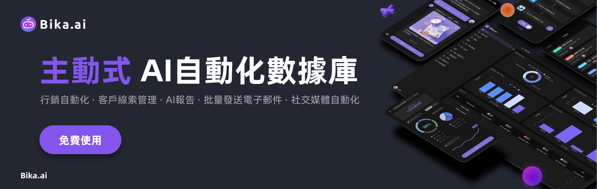

    

  <a href="README.md">English</a>
  | 
<a href="docs/readme/readme_ZH.md">简体中文</a>
  | 
 繁體中文
  | 
   <a href="docs/readme/readme_ja.md">日本語</a>

# 什麼是Bika.ai？ - 自驅協作型AI自動化平台入門指南

> 本文是企業 AI 智能體平台[Bika.ai](https://bikaai.cn/) Bika.ai 的入門指南
>
> [Bika.ai](https://bika.ai) 是一個企業 AI 智能體平台，融合無代碼、多維表格、數據中臺、企業級 AI 知識庫，每日定時主動幫助每個人完成工作、流程匯報、數據收集。
>
> 釋放您的工作時間，擺脫繁瑣的工作，真正讓您有更多的時間享受生活。

## Bika.ai是什麼？

    

 

Bika.ai是一個商業AI智能體平臺，融合無代碼、多維表格、數據中台、企業級AI知識庫，讓AI積極主動地完成各種工作。無需與AI不斷對話，Bika.ai可以自動化重複任務，並且能夠在市場營銷和銷售等多個職能中無縫執行，讓您專注於戰略性工作

傳統的AI工具中，你需要主動跟AI對話，讓AI幫助你完成工作。 而Bika.ai是一個AI主動進行提醒和向人們發起任務的協作式AI自動化平台，你不需要跟AI對話，而是AI定時自動化幫助你或你的團隊，完成一些工作。

### 使用場景

Bika.ai 可用於：

- **行銷自動化**: 幫您批量、定時、間隔地自動發送電子郵件、YouTube視頻、Twitter推文、通知簡訊等行銷內容,實現快速高效的行銷自動化
- **銷售線索管理**: 自動收集、跟蹤和管理上百萬條銷售線索,幫助您系統化地跟進潛在客戶,提高銷售轉化率
- **AI向你匯報**: 定期主動找你建議AI策略和自動化流程,在您決策後才執行,AI還會定期向你生成匯報
- **一站式解決**: 無需複雜的專業軟體,Bika.ai輕量級的AI自動化資料庫,可滿足您的客戶資料儲存、管理和跟蹤需求
- **自訂編輯**: Bika.ai提供強大的低代碼/無代碼編輯器,讓您輕鬆定制各種自動化任務流程和資料系統,實現專案管理、產品工單、訂單管理等更多應用場景

### 重點特色功能

- **開箱即用的自動化模板**: 僅需3分鐘，按步驟快速用AI自動化你的工作流程，還能輕鬆自定義編輯
- **主動式AI自動化**: AI主動管理日常任務，生成及時的提醒，並創建全面的AI報告，一切無需手動操作
- **自動化發布與分享**: 輕鬆發布、分享並發現自動化流程，增強團隊間的協作與效率
- **大數據可視化數據庫**: 支持數億級數據、API操作和儀表板圖表，使得廣泛的分析和數據驅動的決策成為可能

    

Bika.ai 擅長自動化日常市場營銷工作，比如批量發布自媒體內容和批量自動發送郵件，這個工具讓複雜的配置成為過去。

最重要的是，Bika.ai 做到了真正的開箱即用，提供了許多現成的模板，讓你在3分鐘內就能設置適合你業務的AI自動化工作流程。

    

 

Bika.ai 的主動AI自動化會主動管理日常任務，自動生成提醒和全面的AI報告。

它會在沒有任何手動輸入的情況下，通知你的團隊即將到來的任務和項目更新，確保沒有任何事情被遺漏。

用總是領先一步的AI來提升你團隊的生產力和項目管理。

 

與大多數自動化工具不同，Bika.ai 允許你發布和分享你配置的自動化，輕鬆實現團隊間的協作。

將有效的項目管理自動化傳播到各個部門，統一並提升運營效率。

這個工具不僅提高了透明度，還簡化了工作流程，讓團隊效率成為常態。

 

AI自動化會大大增加你的數據量，但不用擔心 —— Bika.ai 的大數據可視化數據庫讓你輕鬆處理數億行數據，并支持API操作。

存儲無盡的客戶數據，利用高級儀表盤圖表做出有洞察力的數據驅動決策，推動你的業務向前發展。

借助直觀的可視化工具，輕鬆深入數據，幫助你一目了然地解讀複雜信息。

 

 

## 快速入門Bika.ai，開始AI自動化

    

 

讓我們快速入門一下Bika.ai，看看短短3分鐘內，習得AI自動化新技能，在今後釋放您的時間。

1. 右上角註冊Bika.ai帳號，[點擊這裡註冊](https://bika.ai/signup).
2. 在空間站界面左側，點擊進入模板中心，看到大量預設好的AI自動化模板；
3. 選擇模板“Slack頻道定時提醒”，進行安裝；
4. 根據模板內的Slack Incoming Webhooks指引，創建Slack應用，並獲取對應Channel Webhook URL；
5. 複製對應Channel Webhook URL，粘貼到模板的URL處；
6. 點擊手動觸發，看到Slack中收到消息，配置成功；
7. 根據需求，調整自動發送文案和發送時間；
8. 手動觸發，確認Slack中的提醒更新正確；
9. 打開自動化“啟動”開關，你的AI自動化就已配置完畢了。

下面簡單介紹原理。

 

## Bika.ai有什麼應用場景？

Bika.ai是一个企业AI智能体平台，结合了大数据多维表格和AI自动化，提供AI Agent增强的客户管理系统、营销自动化系统、项目管理系统、BI和ERP，一切皆以惊人的价格获得。尤其适合以下认识使用：

- 市场营销人员
- KOL内容创作者
- 自动化顾问
- 项目管理经理
- 销售负责人

以下是 Bika.ai 的各种落地场景：

### 📣 营销

对于营销人员和影响者来说，使用Bika.ai自动化日常营销活动（如批量社交媒体发布）有助于成倍扩大您的影响力。

### 💼 销售

在销售中，您可以在短短3分钟内设置批量邮件自动发送，轻松触达客户，大数据可视化数据库支持数十亿行数据，允许您根据需要存储尽可能多的客户数据。

### 📋 项目管理

对于项目经理来说，主动AI自动化可以自动提醒团队成员即将到来的任务，并提供项目状态的详细报告，确保即使是复杂的项目管理也能井井有条。

### 🏠 日常生活

自动化您的日常生活

### 💰 金融

投资者和金融分析师可以通过AI自动化来简化决策过程，比如使用热点股票新闻汇总模板，或自动获取股票数据模板

### 📁 行政

运营人员可以通过自动化招聘流程和发票管理等关键任务显著提高效率，从而简化数据收集并简化处理流程。

## 深入Bika.ai: 是如何讓AI自動完成任務的？

在看完快速入門之後，相信你會發現，使用Bika.ai非常簡單，選擇對應的AI模板，你就可以非常簡單完成各種任務，並微調做更多的事情。

    

 

我們打開主界面UI，深入一下Bika.ai，理解一下它的基礎組件，及它是如何做到的？

 

### 空間站 Space

空間站是你第一次進入Bika.ai看到的界面，涵蓋了你所有工作內容，由個人區域、資源區域、探索區域、展示區域、個人設置、以及空間站管理構成。

 

一個空間站可以有多個成員，每個成員可以有專屬的個人專區，建立多個資源。

### 個人區域 Personal Area

在個人區域中，你可以看到專屬於你的主頁、任務、和報告。主頁很好理解，是你個人相關工作的一個總覽，讓我們來看看「我的待辦」和「報告」。

#### 智能任務

在 Bika.ai 中,「智能任務」是一種由 AI 自動生成的任務機制。

智能任務是審批、任務、請求、審閱、對齊和確認的混合體。

您可以使用智能任務來完成例如待辦事項提醒、讓其他用戶做某些事情、數據收集、報告審閱、工作流程審批,以及確認 AI 生成的草稿等。

 

請注意,Bika.ai 中的「智能任務」與典型待辦事項軟件中的「任務」不同,後者是用戶手動創建和完成的。

在 Bika.ai 中,智能任務通常由 AI 或自動化生成,並自動確定其完成情況。

例如,以「每日銷售匯報」的情景中,AI 會自動為每個銷售生成智慧任務,成員一旦完成數據填報後,並透過 AI 檢查後,這個智能任務會自動完成。

#### 智能報告

智能報告是由人工智慧或自動化系統依據既定規則或數據生成的報告材料,它可以像是一封電子郵件、文章或文檔。

 

例如,作為銷售經理,您每天都會收到AI自動生成的客戶報告,AI已深度整合到日常工作流程中,但仍然服從於您的指示。

### 資源區域 Resource Area

在安裝模板的時候你會發現，一個模板是由多個資源組成的，以下面這個 AI 自動發布 X 推文 的模板為例，它由兩個資源構成：

- 自動化資源：定時發推文
- 數據庫資源：X 推文內容

 

### 探索區域 Explore Area

探索區域方便你拓展Bika的各種可能性，包括模板中心、邀請成員、升級、聯繫客服、幫助與支持。其中模板中心為你提供了豐富的AI自動化模板，讓你可以快速解決工作難題。

 

### 展示區域 Display Area

在這裡，你將可以對你的任務、報告、資源節點進行展示與編輯，方便你了解並管理你的工作內容。

 

### 個人設置 Personal Settings

點擊左下角頭像 -> 個人設置，你可以看到你的個人信息、帳號綁定與安全、通知設置、登錄記錄、開發者 API、以及推薦獎積分。

 

### 空間站管理 Space Management

點擊左上角空間站 -> 齒輪圖標，你可以進行空間站管理和設置，包括：空間站設置、邀請成員、成員管理、角色管理、第三方集成、付費升級、用量&帳單、空間站審計。

 

    

 

## 功能

### 語言

Bika.ai 支持以下系統語言

- 英語
- 簡體中文
- 繁體中文
- 日語

不僅僅是系統語言，數據應用包括數據庫、字段、自動化等內部也支持多語言。 這意味着，如果您可以構建自己的自定義AI數據自動化應用程序，以支持用戶區域的多種語言。

### 節點資源

節點資源是一種特殊的資源，它可以是數據庫、自動化、表單等節點實現。

### 自動化任務 - 觸發器

自動化觸發器作為一個「開關」，當滿足特定條件時就會啟動自動化流程。 你可以這樣理解觸發器：當特定事件發生（觸發器）且某些條件成立時，就會執行相應的事件（動作）。

### 自動化任務 - 執行器

自動化動作是指執行任務、活動、事件或變更的步驟，比如發送電子郵件。 你可以這樣理解動作：當某事發生（觸發器）且滿足指定條件時，就會執行這個事件（動作）。

### 智能任務

任務是一種智慧、自動化、可追蹤的任務，與典型的任務或待辦事項列表不同，後者需要你自己進行勾選確認。例如，考慮「創建記錄任務」：當用戶接收到此任務時，只有在所需記錄被創建後，該任務才會自動被標記為已完成。

### 數據表 - 視圖

數據表視圖提供了一種特定的方式來可視化和排列數據表中的基礎數據。 標準視圖是網格形式，但其他格式包括表單、日曆、圖庫和看板佈局。 一個數據表可以支持多個視圖和各種類型的視圖。

### 數據表 - 欄位

數據表欄位包含每條記錄的詳細信息或元數據。 數據表欄位保存每個條目的信息或元數據。這些欄位可以採用各種形式，允許以文本、單選或多選、圖片、複選框、數字、用戶標籤等形式存儲數據。

### 儀表板 - 組件

組件是一種用於展示和操作數據的工具，你可以在數據表、視圖、儀表板中添加各種組件，以滿足不同的數據展示和操作需求。

### 三方集成

集成是 Bika.ai 與外部服務或應用程序之間的連接，可實現平台之間的無縫數據傳輸。 你選擇的集成最終取決於你想要用數據解決的具體問題。 例如，如果你有一個追蹤任務的數據庫記錄，並且想要使用 AI 進行總結，你可以利用 OpenAI 集成將數據發送到 OpenAI，然後使用返回的信息發送郵件。

### 產品比較

Bika.ai 將 Airtable（數據庫）和 Zapier（自動化）結合成一個簡單易用的智能平台，提供 AI Agent 增強的 CRM、營銷自動化系統、項目管理系統、商業智能（BI）和企業資源規劃（ERP），所有這些都以驚人的價格提供。

- [airtable](https://airtable.com/): 與Airtable相比，Bika.ai更專注於AI自動化和主動協助。Bika.ai更適合於需要在工作和生活中獲得更多自動化和AI協助的用戶。
- [zapier](https://zapier.com/): 與Zapier相比，Bika.ai更專注於開箱即用的模板和數據庫工作流。Bika.ai更適合於需要在工作和生活中獲得更多自動化和AI協助的用戶。
- [vika維格表(維格雲)](https://vika.cn/): 與vika維格表相比，Bika.ai 更專注於 AI 自動化和主動式協助。Bika.ai 更適合需要更多自動化和 AI 協助的用戶。

### 更多功能

總的來說，Bika.ai提供一系列讓AI主動、自動化的新奇的功能，從個人到企業都適用。

- 空間站：空間站是你個人或團隊的工作空間，一個空間站可以有多個成員，每個成員可以有多個任務、報告、資源、AI Agent等；
- 資源：資源是一種可以被AI自動化操作的對象，包括：
  - 自動化流程：設置定時、觸發事件，自動化完成某些事情
  - 數據表：與多維表格、數據庫表格類似的，結構化的表格，支持億級數據行
  - 視圖: 將數據表中的一種視圖，如網格視圖、圖庫視圖、腦圖視圖、看板視圖、全功能網格視圖、日曆視圖等，獨立在資源中；
- 任務： 與你理解的“個人任務”不同，是AI自動化生成的任務，由AI自動化去判斷有沒有完成；
- 報告：有自動化或AI進行匯總，生成的文案報告；
- 數據表：
  - `大數據量`: 億級數據行的多維表格，支持大數據量圖表生成、AI數據訓練；
  - `豐富的API`: 從 `數據(Data)` 到 `元數據(Metadata)` 的全棧式OpenAPI訪問，將Bika.ai當成PostgresSQL、MySQL等業務數據庫使用；
  - `關聯`: 單向/雙向表鏈接和 `無限交叉鏈接`
  - `AI 搜尋`：對整個資料表、檢視、知識庫進行 AI 搜尋和問答，化為生產力知識庫；
  - `增刪改查`: 創建、瀏覽、更新、刪除表、列和行
  - `個性化工具欄`: 每位用戶使用數據表工具欄作出的篩選、分組等操作都是獨立的，不會影響其他用戶
  - `字段操作`: 排序、過濾、分組、隱藏/取消隱藏、高度設置。
  - `基於空間(Space)`：使用分離的工作空間來代替基於 App/Base 的結構，使無限的表格連接成為可能。
  - `暗色模式` 和主題定制。
  - `7 種視圖類型`: 網格視圖(Datasheet) / 圖庫視圖 / 腦圖視圖/ 看板視圖 / 全功能網格視圖 / 日曆視圖
- 模板： 真正的一站式模板，將自動化、第三方集成、數據表、組織角色打包在一起，一鍵安裝，一鍵使用；
  - 升級模板: 安裝後的模板，可以跟隨官方升級，也可以自己進行輕量級微調
  - 發布模板: 一站式、全棧式的模板，可以對外發布，甚至對外售賣模板，保護的知識產權，模板不會安裝後就失去控制權；
- 個人與團隊、企業級結構管理：
- 多語言：默認支持英文、簡體中文、繁體中文、日語，無縫支持跨國團隊協作，更多語言等你來提；
- 企業級權限
  - 權限：支持個人、團隊、企業級權限，支持個人局部權限、行權限、列權限、文件夾權限等；
  - 獨立資源`視圖`, 將視圖變成鏡像以實現更高級的權限隔離；
  - 通過非常簡單的操作激活 `列權限`
  - 文件夾/子文件夾/文件權限
  - 樹結構文件夾和可自定義的資源（節點文件）
  - 團隊管理 & 組織架構
  - 支持OEM貼牌和私有化部署
- 未來更多功能
  - AI語音：全智能
  - AI創建：
  - Terraform資源控制
  - 集成 n8n.io / Zapier / make.com / Appsmith等更多
  - 單點登錄（SSO）/SAML等身份驗證
  - 定制擴展和插件
  - 審計
  - 數據庫自動備份/導出
  - 安全水印
  - Slack/WhatsApp/Teams/Telegram/釘釘/企業微信/飛書集成
- ....

## 完全免費試用

    

 

目前Bika.ai完全免費使用，而且用量非常慷慨，你可以參考免費規格，你可以詳情查看[價目表](https://bika.ai/pricing)。

如果你有想法，想提出一些功能，請加入我們社區，用力吐槽和給建議哈：https://bika.ai/contact。

如果你有進一步的功能需要，如私有化部署、功能定時等，請聯繫我們的[高級管理人員](?contact=1)。

 

## 常見問題解答: 什麼是Bika.ai?

### Bika.AI是免費使用的嗎？
是的，目前Bika.AI是完全免費使用，而且用量非常慷慨，你可以參考免費規格。 如果您超出了免費規格，或者，你想享受定制功能、私有化部署等更多服務，可以[聯繫銷售](https://bika.ai/zh-TW/blog/what-is-bika-ai?contact=1)

 

### 一句話快速介紹：什麼是Bika.ai?
Bika.ai 是一個AI自動化工具，透過結合表格型數據庫和AI技術，自動化地優化數據管理和任務處理，幫助您更高效地執行工作流程。

 

### 是什麽让 Bika.ai 如此独特？
Bika.ai 提供了一個開箱即用的自動化數據庫，內置豐富的功能和第三方整合。不管數據量有多大，哪怕是數十億條數據，Bika.ai 都能輕鬆應對。使用 Bika.ai，您無需不斷與 AI 對話，數據量也不再是問題。

通過 Bika.ai 自動完成任務，工作更高效精確，節省大量時間。用戶還能輕鬆發布、分享和複製自動化模板，便於持續改進。如果你想讓市場營銷、銷售或項目管理更簡單，同時用 AI 自動化來提升數據處理能力，Bika.ai 就是你的理想選擇。

 

### "BIKA" 這個縮寫單詞代表什麼意思？
B-I-K-A是「業務智能與知識自動化（Business Intelligence and Knowledge Automation）」的縮寫，商業智能+知識自動化+AI

 

### Bika.ai是怎麼做到AI自動化做事的？
Bika.ai的起點不是“聊天框”，而是“自動化”，透過設置自動化和一些觸發條件，如定時、新數據新增等，來觸發AI自動化做事。 實際上，Bika.ai是一個“AI自動化工具”，而不是一個“AI助手”，它使用自動化功能而不依賴於大型AI模型，這意味著不需要消耗AI推理成本。透過Bika.ai的任務、匯總、資源等核心組件，可以有效地完成許多工作，節省您的時間，讓您有更多時間享受生活。 直接前往[模板中心](https://bika.ai/template)來獲取適合你的解決方案。

 

### Bika.ai與ChatGPT、Gemini等AI助手有什麼區別？
ChatGPT、Gemini、Claude等AI助手，是基於大模型的AI聊天助手，需要消耗大量的AI推理成本， 而Bika.ai是一個AI自動化、數據庫工具，自動化地完成任務。 兩者是完全不一樣的產品，你可以瀏覽一下AI自動化模板中心，看看有沒有滿足你日常需求的[模板](https://bika.ai/template)？

 

### Bika.ai與多維表格有什麼區別？
市面上有很多優秀的多維表格工具，如[AITable.ai](https://aitable.ai/)、[Airtable](https://airtable.com/) 等。 確實Bika.ai與多維表格的核心是類似的：表格型數據庫、自動化等。 多維表格更擅長協作，但Bika.ai是以“任務”、“彙報”、“AI自動化”為主，並不以表格為主，Bika.ai旨在利用AI充分把數據用起來的AI自動化工具。

 

### Bika.ai 在單表數據量、關聯引用變多後，如幾萬行、幾十萬行，會卡住嗎？
不會。Bika.ai 的資料表在架構設計時就已考慮到海量數據的需求，底層綜合運用了 OLTP 業務資料庫、OLAP 分析資料庫、NoSQL 資料庫、時間序列資料庫、索引資料庫以及向量資料庫等技術，確保即使達到千萬級、億級的數據量,系統仍能保持流暢高效的效能表現。

 

### Bika.AI中的"空間站"是什麼?
"空間站"是您的組織或團隊所有成員的協作平台。通過單擊Bika.ai工作台左上角的空間圖標,可以訪問您的個性化管理和受邀空間。

 

### 付款後我擁有多少個付費空間？
Bika.ai 採用空間訂閱模式。當您購買訂閱時，您將獲得一個空間。您擁有的空間數量等於您購買的訂閱數量。每個空間都包含您購買條款中規定的特定使用權。

 

### 什麼是"資源"?
"資源"一詞指的是您空間資源部分左側目錄樹文件中的文件節點，如自動化、數據庫、表單、儀表板等。 被刪除的資源不會被計算在內。創建一個新的數據庫和一個新的表單會增加兩個文件節點到您的計數中。刪除其中一個項目會使計數減少一個。

 

### Bika.ai 的團隊是如何「吃自己的狗糧」的？
好問題,我們自己內部非常熱愛使用 Bika.ai。 在內部,我們應用 Bika.ai 於:每日晨會通知/收集/彙整、每週 scrum 工作迭代通知/收集/彙整、定時給運營經理審批並發送 twitter 公眾號文章、每日銷售數據分析報告生成、功能需求和 BUG AI 自動化管理、定期行銷電郵發送等等等,盡量將重複性、日常化的工作交給 AI 自動化。 Bika.ai 團隊運營著 3 個 SaaS 平台產品、30+ 個部署、百萬的用戶、數萬個團隊客戶,我們也急需一個更 AI 自動化的工具,來減少我們的重複工作,這是我們開發 Bika.ai 的初衷。 我們希望我們的用戶,使用 Bika.ai 是「用完就走」的 —— 只要進去軟體,初始化和設置後,之後大部分的工作,都交給 AI 自動化。

 

### Bika.ai如何幫助提高工作效率？
Bika.ai 通過其強大的自動化功能幫助用戶自動執行常規任務。用戶可以根據自己的需求設置自動化任務，比如數據更新通知、任務調度和自動報告生成等，從而減少人工操作，提高工作效率。你可以直接前往[模板中心](https://bika.ai/template)來獲取適合你的解決方案。

 

### Bika.ai 的AI自動化功能有哪些特點？
Bika.ai 的AI自動化功能允許用戶創建基於條件的任務，這些任務可以在滿足特定條件時自動觸發。例如，當一個數據表接收到新數據時，Bika.ai 可以自動進行數據處理和分析，甚至發送通知給相關人員。直接前往[模板中心](https://bika.ai/template)來感受吧。

### Bika.ai 中的自動化模板是什麼？
自動化模板是預先設定的任務流程，用戶可以直接應用這些模板，3分鐘來自動化特定的工作流程。這些模板涵蓋了從數據錄入到複雑數據處理的各種常見場景，使用戶能夠快速部署和利用AI技術。建議你可以直接前往[模板中心](https://bika.ai/template)進行使用。

 

### Bika.ai 是否支持团队协作及权限功能？
是的，Bika.ai 提供了“空间站”功能，这是一个团队协作平台，，不仅允许团队内部成员共享资源、管理数据和协同工作，还能良好地支持与外部团队或个人的协作。空间站支持个性化设置和权限管理，确保团队成员可以高效地协作。

 

    

