

    <a href="https://https://bikaai.cn/auth?redirect=%2Fspace" target="_blank">
        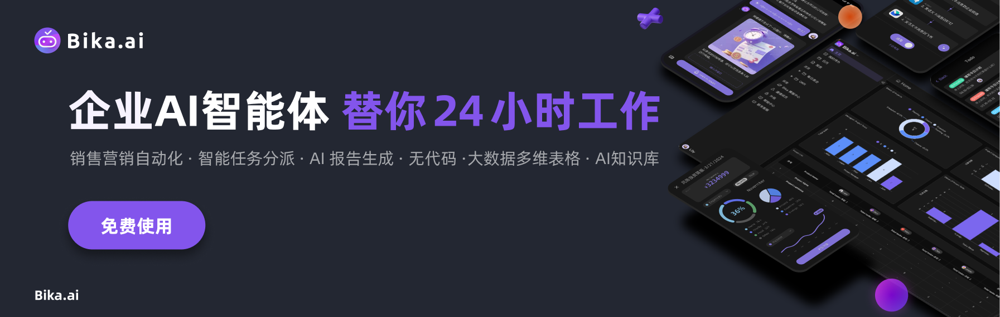
    </a>

  <a href="README.md">English</a>
  | 
  简体中文
  | 
  <a href="docs/readme/readme_TW.md">繁體中文</a>
  | 
   <a href="docs/readme/readme_ja.md">日本語</a>

# 什么是Bika.ai？ - 企业AI智能体平台入门指南

> 本文是企业 AI 智能体平台[Bika.ai](https://bikaai.cn/) 的入门指南
>
> [Bika.ai](https://bikaai.cn/) 是一个企业AI智能体平台，融合无代码、多维表格、数据中台、企业级AI知识库，每日定时主动帮助每个人完成工作、流程汇报、数据收集。
>
> 释放您的工作时间，摆脱繁杂的工作，真正让您有更多的时间享受生活。

## Bika.ai是什么？

    

 

Bika.ai是一个企业AI智能体平台，融合无代码、多维表格、数据中台、企业级AI知识库，让AI积极主动地完成销售自动化、营销自动化、项目管理AI化。无需与AI不断对话，Bika.ai可以自动化重复任务，让您专注于战略性工作。

传统的AI工具中，你需要主动跟AI对话，让AI帮助你完成工作。 而Bika.ai是一个AI主动进行提醒和向人们发起任务的协作式AI自动化平台，你不需要跟AI对话，而是AI定时自动化帮助你或你的团队，完成一些工作。

### 使用场景

Bika.ai 可用于：

- **营销自动化**: 帮您批量、定时、间隔地自动发送电子邮件、企业微信/钉钉/飞书通知、小红书/知乎文章、通知短信等内容,实现快速高效的营销自动化
- **销售线索管理**: 自动收集、跟踪和管理上百万条销售线索,帮助您系统化地跟进潜在客户,提高销售转化率
- **AI向你汇报**: 定期主动找你建议AI策略和自动化流程,在您决策后才执行,AI还会定期向你生成汇报
- **一站式解决**: 无需复杂的专业软件,Bika.ai轻量级的AI自动化数据库,可满足您的客户数据储存、管理和跟踪需求
- **自定义编辑**: Bika.ai提供强大的低代码/无代码编辑器,让您轻松定制各种自动化任务流程和数据系统,实现项目管理、产品工单、订单管理等更多应用场景

### 重点特色功能

- **开箱即用的自动化模板**: 仅需3分钟，按步骤快速用AI自动化你的工作流程，还能自定义编辑。
- **主动式AI自动化**: AI主动管理日常任务，生成及时的提醒，并创建全面的AI报告，一切无需手动操作。
- **自动化发布与分享**: 轻松发布、共享并发现自动化流程，增强团队间的协作与效率。
- **大数据可视化数据库**: 支持数十亿行数据、API操作和仪表板图表，使得广泛的分析和数据驱动的决策成为可能。

    

Bika.ai 擅长自动化日常市场营销工作，比如批量发布自媒体内容和批量自动发送邮件，这个工具让复杂的配置成为过去。

最重要的是，Bika.ai 做到了真正的开箱即用，提供了许多现成的模板，让你在3分钟内就能设置适合你业务的AI自动化工作流程。

    <a href="https://bikaai.cn" target="_blank">
        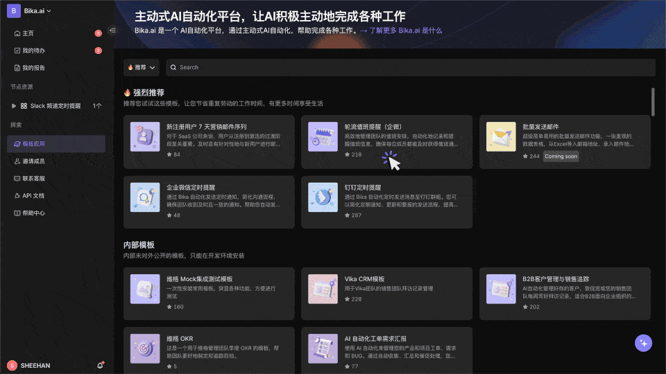
    </a>

 

Bika.ai 的主动AI自动化会主动管理日常任务，自动生成提醒和全面的AI报告。

它会在没有任何手动输入的情况下，通知你的团队即将到来的任务和项目更新，确保没有任何事情被遗漏。

用总是领先一步的AI来提升你团队的生产力和项目管理。

 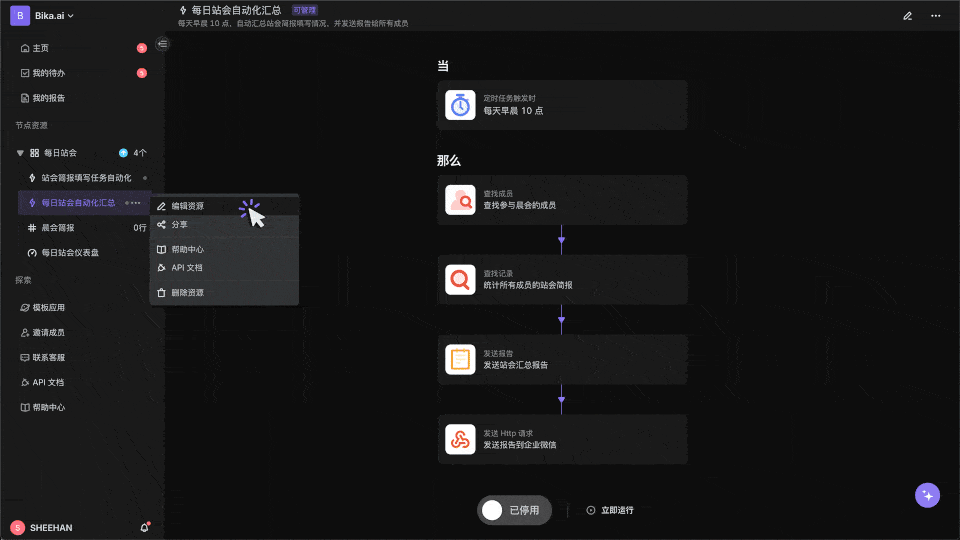

与大多数自动化工具不同，Bika.ai 允许你发布和分享你配置的自动化，轻松实现团队间的协作。

将有效的项目管理自动化传播到各个部门，统一并提升运营效率。

这个工具不仅提高了透明度，还简化了工作流程，让团队效率成为常态。

 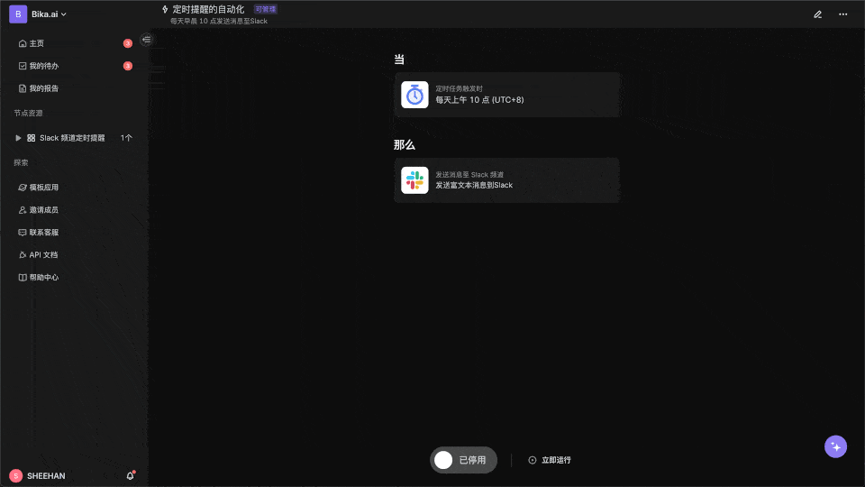

AI自动化会大大增加你的数据量，但不用担心 —— Bika.ai 的大数据可视化数据库让你轻松处理数亿行数据，并支持API操作。

存储无尽的客户数据，利用高级仪表盘图表做出有洞察力的数据驱动决策，推动你的业务向前发展。

借助直观的可视化工具，轻松深入数据，帮助你一目了然地解读复杂信息。

 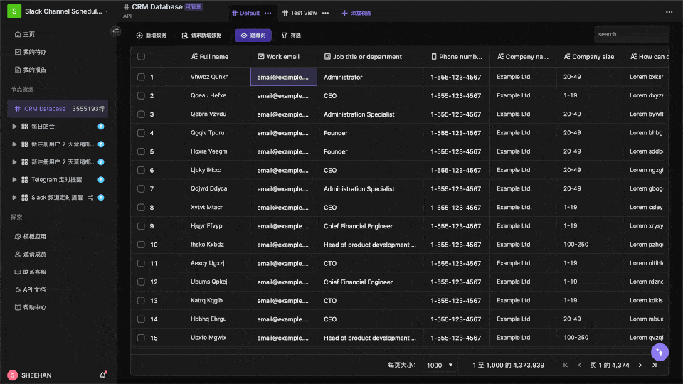

 

## 快速入门Bika.ai，开始AI自动化

    

 

让我们快速入门一下Bika.ai，看看短短3分钟内，习得AI自动化新技能，在今后释放您的时间。

1. 右上角注册Bika.ai账号，[点击这里注册](https://bikaai.cn/signup).
2. 在空间站界面左侧，点击进入模板中心，看到大量预设好的AI自动化模板；
3. 选择「企业微信定时提醒」，进行安装；
4. 在企业微信中创建群机器人，复制Webhook地址，粘贴到模板的URL处；
5. 点击手动触发，看到企业微信中收到消息，配置成功；
6. 根据需求，调整自动发送时间和发送文案；
7. 手动触发，确认企业微信中的提醒更新正确obs；
8. 打开自动化“启动”开关，你的AI自动化就已配置完毕了；

下面简单介绍原理。

 

## Bika.ai有什么应用场景？

Bika.ai是一个企业AI智能体平台，结合了大数据多维表格和AI自动化，提供AI Agent增强的客户管理系统、营销自动化系统、项目管理系统、BI和ERP，一切皆以惊人的价格获得。尤其适合以下认识使用：

- 市场营销人员
- KOL内容创作者
- 自动化顾问
- 项目管理经理
- 销售负责人

以下是 Bika.ai 的各种使用场景：

### 📣 营销

对于营销人员和影响者来说，使用Bika.ai自动化日常营销活动（如批量社交媒体发布）有助于成倍扩大您的影响力。

### 💼 销售

在销售中，您可以在短短3分钟内设置批量邮件自动发送，轻松触达客户，大数据可视化数据库支持数十亿行数据，允许您根据需要存储尽可能多的客户数据。

### 📋 项目管理

对于项目经理来说，主动AI自动化可以自动提醒团队成员即将到来的任务，并提供项目状态的详细报告，确保即使是复杂的项目管理也能井井有条。

### 🏠 日常生活

自动化您的日常生活

### 💰 金融

投资者和金融分析师可以通过AI自动化来简化决策过程，比如使用热点股票新闻汇总模板，或自动获取股票数据模板

### 📁 行政

运营人员可以通过自动化招聘流程和发票管理等关键任务显著提高效率，从而简化数据收集并简化处理流程。

## 深入Bika.ai: 是如何让AI自动完成任务的？

在看完快速入门之后，相信你会发现，使用Bika.ai非常简单，选择对应的AI模板，你就可以非常简单完成各种任务，并微调做更多的事情。

    

 

我们打开主界面UI，深入一下Bika.ai，理解一下它的基础组件，及它是如何做到的？

 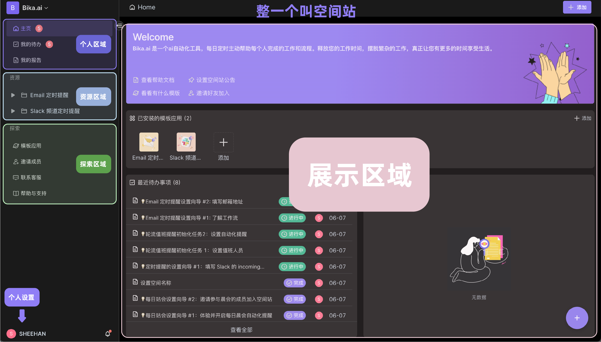

### 空间站 Space

空间站是你第一次进入Bika.ai看到的界面，涵盖了你所有工作内容，由个人区域、资源区域、探索区域、展示区域、个人设置、以及空间站管理构成。

 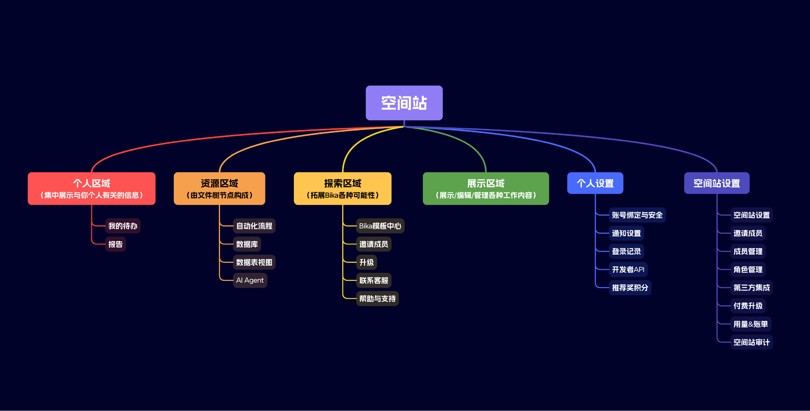

一个空间站可以有多个成员，每个成员可以有专属的个人专区，建立多个资源。

### 个人区域 Personal Area

在个人区域中，你可以看到专属于你的主页、任务、和报告。主页很好理解，是你个人相关工作的一个总览，让我们来看看「我的待办」和「报告」。

#### 智能任务

在 Bika.ai 中,"智能任务"是一种 AI 自动生成任务的机制。

你可以类比理解，智能任务是审批、任务、请求、评审、对齐和批准的混合体。

您可以将智能任务用于诸如待办事项提醒、请求其他用户执行某些操作、数据收集、报告评审、工作流审批以及确认 AI 生成的草稿等场景。

 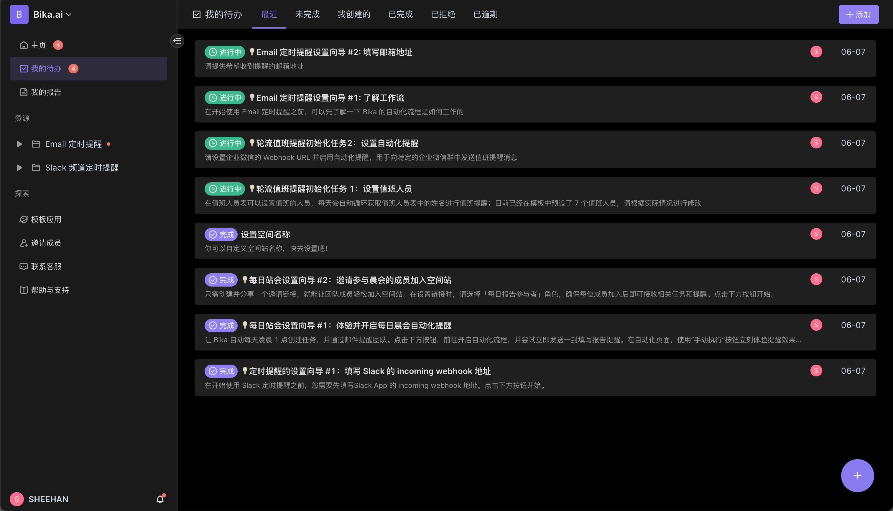

需要注意的是,Bika.ai 中的"智能任务"与传统待办事项软件中的"任务"有所不同,后者是用户手动创建和打勾的待办任务。

在 Bika.ai 中,智能任务通常由 AI 或自动化生成,并自动确认其完成情况。

例如,以"每日销售汇报"的情景中,AI 会自动为每个销售生成智能任务, 成员一旦完成数据填报后, 并通过AI检查后, 这个智能任务会被自动完成。

#### 智能报告

智能报告，是由AI或自动化，基于设定的规则或数据进行生成报告材料，有点像一篇邮件、文章、文档。

 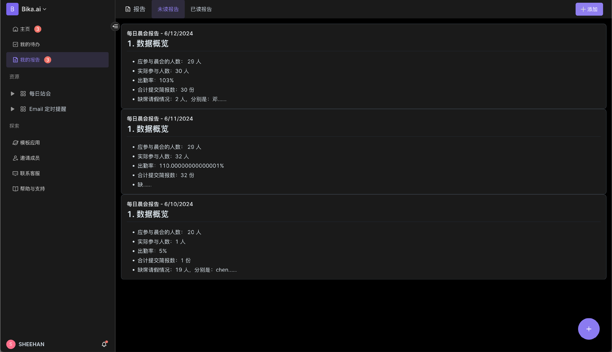

例如,作为销售经理,每日客户报告会由AI自动生成并汇报给您,AI自动化深度集成在日常流程中,但仍然乖巧地服从于您。

### 资源区域 Resource Area

在安装模板的时候你就发现看到，一个模板是有多个资源组成的，以下面的这个 AI 自动发布 X 推文 的模板为例，它由两个资源构成：

- 自动化资源: 定时发推文
- 数据库资源: X 推文内容

 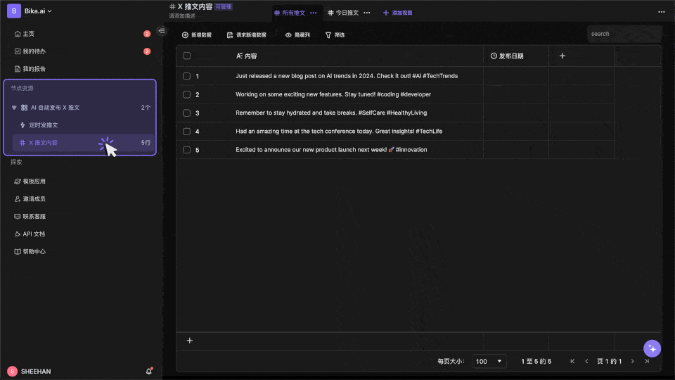

### 探索区域 Explore Area

探索区域方便你拓展Bika的各种可能性，包括模板中心、邀请成员、升级、联系客服、帮助与支持。其中模板中心为你提供了丰富的AI自动化模板，让你可以快速解决工作难题。

 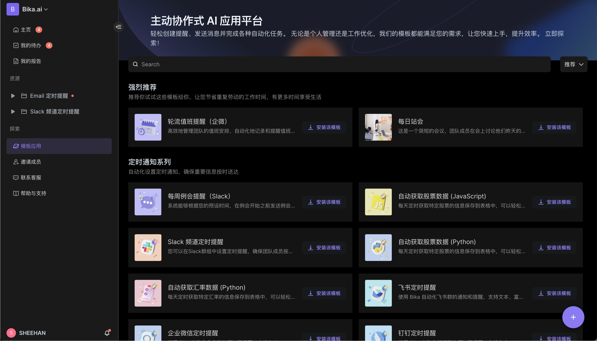

### 展示区域 Display Area

在这里，你将可以对你的任务、报告、资源节点进行展示与编辑，方便你了解并管理你的工作内容。

 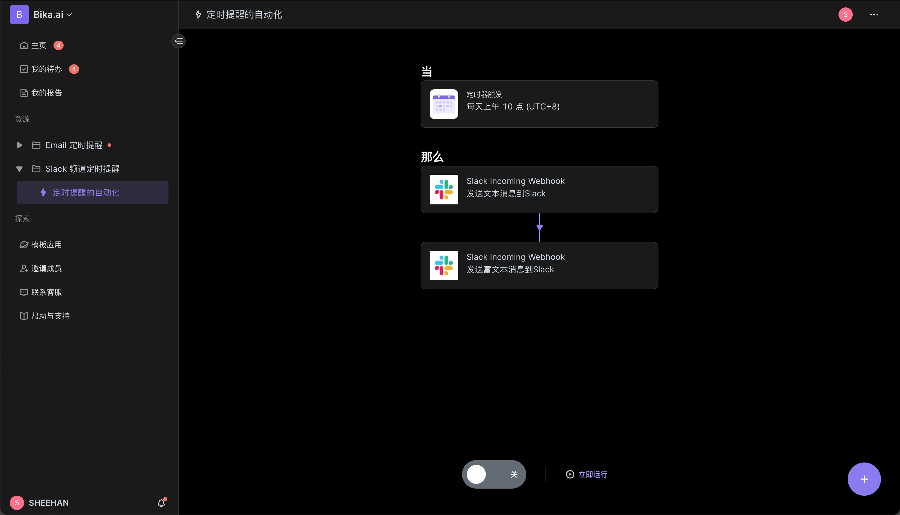

### 个人设置 Personal Settings

点击左下角头像 -> 个人设置，你可以看到你的个人信息、账号绑定与安全、通知设置、登录记录、开发者 API、以及推荐奖积分。

 

### 空间站管理 Space Management

点击左上角空间站 -> 齿轮图标，你可以进行空间站管理和设置，包括：空间站设置、邀请成员、成员管理、角色管理、第三方集成、付费升级、用量&账单、空间站审计。

 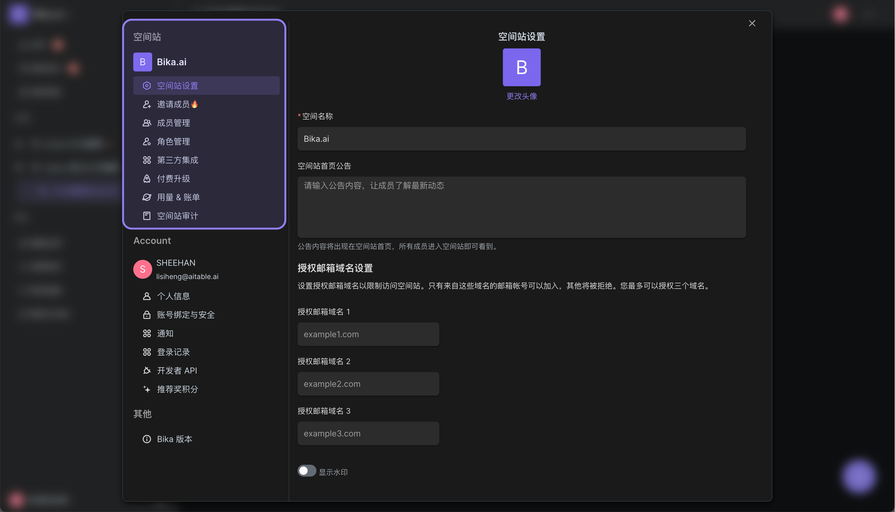

    

 

## 功能清单

### 语言

Bika.ai 支持以下系统语言

- 英文
- 简体中文
- 繁体中文
- 日文

不仅仅是系统语言，数据应用包括数据库、字段、自动化等内部也支持多语言。 这意味着，如果您可以构建自己的自定义AI数据自动化应用程序，以支持用户区域的多种语言。

### 节点资源

节点资源是一种特殊的资源，它可以是数据库、自动化、表单等节点实现。

### 自动化任务 - 触发器

自动化触发器作为一个"开关"，当满足特定条件时就会启动自动化流程。 你可以这样理解触发器：当特定事件发生（触发器）且某些条件成立时，就会执行相应的事件（动作）。

### 自动化任务 - 执行器

自动化动作是指执行任务、活动、事件或变更的步骤，比如发送电子邮件。 你可以这样理解动作：当某事发生（触发器）且满足指定条件时，就会执行这个事件（动作）。

### 智能任务

任务是一种智能、自动化、可追踪的任务，与典型的任务或待办事项列表不同，后者需要你自己进行勾选确认。例如，考虑 “创建记录任务”：当用户接收到这个任务时，只有在所需记录被创建后，该任务才会自动被标记为已完成。

### 数据表 - 视图

数据表视图提供了一种特定的方式来可视化和组织数据表中的基础数据。 标准视图是网格形式，但还包括表单、日历、图库和看板等其他布局形式。 一个数据表可以支持多个视图和各种类型的视图。

### 数据表 - 字段

数据表字段包含数据表中每条记录的详细信息或元数据。 数据表字段存储每个数据条目的信息或元数据。这些字段可以采用多种形式，允许数据以文本、单选或多选、图片、复选框、数字、用户标签等形式存储。

### 仪表盘 - 组件

组件是一种用于展示数据的可视化工具，可以在仪表盘中添加多个组件，以便快速查看和分析数据。组件支持多种类型，如表格、图表、计数器、进度条等，满足不同数据展示需求。

### 集成应用

集成是 Bika.ai 与外部服务或应用程序之间的连接，可实现平台之间的无缝数据传输。 你选择的集成最终取决于你想要用数据解决的具体问题。 例如，如果你有一个跟踪任务的数据库记录，并且想要使用 AI 进行总结，你可以利用 OpenAI 集成将数据发送到 OpenAI，然后使用返回的信息发送邮件。

### 产品比较

Bika.ai是一个企业AI智能体平台，融合了大数据多维表格和自动化连接器的功能，提供AI Agent增强的客户管理系统、营销自动化系统、项目管理系统、BI和ERP，一切皆以惊人的价格获得。

- [vika维格表(维格云)](https://vika.cn/): 与vika维格表相比，Bika.ai 更专注于 AI 自动化和主动式协助。Bika.ai 更适合需要更多自动化和 AI 协助的用户。
- [飞书多维表格](https://www.feishu.cn/product/base): 与飞书多维表格相比，Bika.ai 更专注于模板和数据库工作流。Bika.ai 更适合需要更多自动化和 AI 协助的用户。

### 更多功能

总的来说，Bika.ai提供一系列让AI主动、自动化的新奇的功能，从个人到企业都适用。

- 空间站：空间站是你个人或团队的工作空间，一个空间站可以有多个成员，每个成员可以有多个任务、报告、资源、AI Agent等；
- 资源：资源是一种可以被AI自动化操作的对象，包括：
  - 自动化流程：设置定时、触发事件，自动化完成某些事情
  - 数据表：与多维表格、数据库表格类似的，结构化的表格，支持亿级数据行
  - 视图: 将数据表中的一种视图，如网格视图、图库视图、脑图视图、看板视图、全功能网格视图、日历视图等，独立在资源中；
- 任务： 与你理解的“个人任务”不同，是AI自动化生成的任务，由AI自动化去判断有没有完成;
- 报告：有自动化或AI进行汇总，生成的文案报告；
- AI搜索：对整个数据表、视图、空间站进行AI搜索和问答，成为生产力知识库；
- 数据表：
  - `大数据量`: 亿级数据行的多维表格，支持大数据量图表生成、AI数据训练；
  - `丰富的API`: 从 `数据(Data)` 到 `元数据(Metadata)` 的全栈式OpenAPI访问，将Bika.ai当成PostgresSQL、MySQL等业务数据库使用；
  - `关联`: 单向/双向表链接和 `无限交叉链接`
  - `增删改查`: 创建、浏览、更新、删除表、列和行
  - `个性化工具栏`: 每位用户使用数据表工具栏作出的筛选、分组等操作都是独立的，不会影响其他用户
  - `字段操作`: 排序、过滤、分组、隐藏/取消隐藏、高度设置。
  - `基于空间(Space)`：使用分离的工作空间来代替基于 App/Base 的结构，使无限的表格连接成为可能。
  - `暗色模式` 和主题定制。
  - `7 种视图类型`: 网格视图(Datasheet) / 图库视图 / 脑图视图/ 看板视图 / 全功能网格视图 / 日历视图
- 模板： 真正的一站式模板，将自动化、第三方集成、数据表、组织角色打包在一起，一键安装，一键使用；
  - 升级模板: 安装后的模板，可以跟随官方升级，也可以自己进行轻量级微调
  - 发布模板: 一站式、全栈式的模板，可以对外发布，甚至对外售卖模板，保护的知识产权，模板不会安装后就失去控制权；
- 个人与团队、企业级结构管理：
- 多语言：默认支持英文、简体中文、繁体中文、日语，无缝支持跨国团队协作，更多语言等你来提；
- 企业级权限
  - 权限：支持个人、团队、企业级权限，支持个人局部权限、行权限、列权限、文件夹权限等；
  - 独立资源`视图`, 将视图变成镜像以实现更高级的权限隔离；
  - 通过非常简单的操作激活 `列权限`
  - 文件夹/子文件夹/文件权限
  - 树结构文件夹和可自定义的资源（节点文件）
  - 团队管理 & 组织架构
  - 支持OEM贴牌换LOGO、私有化部署；
- 未来更多功能
  - AI语音：全智能
  - AI创建：
  - Terraform资源控制
  - 集成 n8n.io / Zapier / make.com / Appsmith等更多
  - 单点登录（SSO）/SAML等身份验证
  - 定制扩展和插件
  - 审计
  - 数据库自动备份/导出
  - 安全水印
  - 钉钉/企业微信/飞书/Slack/Teams集成
- ....

## 完全免费试用

    

 

目前Bika.ai完全免费使用，而且用量非常慷慨，你可以参考免费规格，你可以详情查看[价目表](hhttps://bikaai.cn/pricing)。

如果你有想法，想提出一些功能，请加入我们社区，用力吐槽和给建议哈：https://bikaai.cn/contact。

如果你有进一步的功能需要，如私有化部署、功能定时等，请联系我们的[高级管理人员](https://bika.ai/zh-CN/blog/what-is-bika-ai?m=eyJuYW1lIjoiQ09OVEFDVF9TRVJWSUNFIn0=)。

 

## 常见问题解答: 什么是Bika.ai?

### Bika.AI是免费使用的吗？
是的，目前Bika.AI是完全免费使用，而且用量非常慷慨，你可以参考免费规格。 如果您超出了免费规格，或者，你想享受定制功能、私有化部署等更多服务，可以[联系销售](https://bikaai.cn/zh-CN/blog/what-is-bika-ai?contact=1)

 

### 是什么让 Bika.ai 如此独特？
Bika.ai 提供了一个开箱即用的自动化数据库，内置丰富的功能和第三方集成。不管数据量有多大，哪怕是数十亿条数据，Bika.ai 都能轻松应对。使用 Bika.ai，您无需不断与 AI 对话，数据量也不再是问题。

通过 Bika.ai 自动完成任务，工作更高效精确，节省大量时间。用户还能轻松发布、分享和复制自动化模板，便于持续改进。如果你想让市场营销、销售或项目管理更简单，同时用 AI 自动化来提升数据处理能力，Bika.ai 就是你的理想选择。

 

### 一句话快速介绍：什么是Bika.ai?
Bika.ai 是一个AI自动化工具，通过结合表格型数据库和AI技术，自动化地优化数据管理和任务处理，帮助您更高效地执行工作流程。

 

### "BIKA" 这个缩写单词代表什么意思？
B-I-K-A 是「业务智能与知识自动化 (Business Intelligence and Knowledge Automation)」的缩写，商业智能+知识自动化+AI。

 

### Bika.ai是怎么做到AI自动化做事的？
Bika.ai的起点不是“聊天框”，而是“自动化”，通过设置自动化和一些触发条件，如定时、新数据新增等，来触发AI自动化做事。 实际上，Bika.ai是一个“AI自动化工具”，而不是一个“AI助手”，它使用自动化功能而不依赖于大型AI模型，这意味着不需要消耗AI推理成本。通过Bika.ai的任务、汇总、资源等核心组件，可以有效地完成许多工作，节省您的时间，让您有更多时间享受生活。 直接前往[模板中心](https://bikaai.cn/template)来获取适合你的解决方案。

 

### Bika.ai与Kimi、ChatGPT等AI助手有什么区别？
Kimi、ChatGPT、文心一言等AI助手，是基于大模型的AI聊天助手，需要消耗大量的AI推理成本， 而Bika.ai是一个AI自动化、数据库工具，自动化地完成任务。 两者是完全不一样的产品，你可以浏览一下AI自动化模板中心，看看有没有满足你日常需求的[模板](https://bika.ai/template)？

 

### Bika.ai与多维表格有什么区别？
市面上有很多优秀的多维表格工具，如多维表格首创者[vika维格云](https://vika.cn/)、[飞书多维表格](https://www.feishu.cn/product/base) 、腾讯企业微信智能表格等。 确实Bika.ai与多维表格的核心是类似的：表格型数据库、自动化等。 多维表格更擅长协作，但Bika.ai是以“任务”、“汇报”、“AI自动化”为主，并不以表格为主，Bika.ai旨在利用AI充分把数据用起来的AI自动化工具。

 

### Bika.ai在单表数据量、关联引用变多后，如几万行、几十万行，会卡吗？
不会，Bika.ai的数据表在架构设计时以海量数据的方式设计和考虑，底层综合混用了业务数据库OLTP、分析数据库OLAP、NoSQL数据库、时序数据库、索引数据库、向量数据库的技术，来确保千万级、亿级数据量都能保持流程和高性能的表现。

 

### Bika.AI中的"空间站"是什么?
"空间站"是您的组织或团队所有成员的协作平台。通过单击Bika.ai工作台左上角的空间图标,可以访问您的个性化管理和受邀空间。

 

### 付款后我拥有多少个付费空间？
Bika.ai 采用空间订阅模式。当您购买订阅时，您将获得一个空间。您拥有的空间数量等于您购买的订阅数量。每个空间都包含您购买条款中规定的特定使用权。

 

### 什么是"资源"?
"资源"一词指的是您空间资源部分左侧目录树文件中的文件节点，如自动化、数据库、表单、仪表板等。 被删除的资源不会被计算在内。创建一个新的数据库和一个新的表单会增加两个文件节点到您的计数中。删除其中一个项目会使计数减少一个。

 

### Bika.ai的团队是怎样”吃自己的狗粮“(应用自己的产品)的？
好问题，我们自己内部非常热爱使用Bika.ai。 在内部，我们应用Bika.ai于：每日晨会通知/收集/汇总、每周scrum工作迭代通知/收集/汇总、定时给运营经理审批并发送twitter公众号文章、每日销售数据分析报告生成、功能需求和BUG AI自动化管理、定期营销邮件发送等等等，尽量将重复性、日常化的工作交给AI自动化。 Bika.ai团队运行着3个SaaS平台产品、30+个部署、百万的用户、数万个团队客户，我们也急需一个更AI自动化的工具，来减少我们的重复工作，这是我们开发Bika.ai的初心。 我们希望我们的用户，使用Bika.ai是「用完就走」的 —— 只要进去软件，初始化和设置后，之后大部分的工作，都交给AI自动化。

 

### Bika.ai如何帮助提高工作效率？
Bika.ai 通过其强大的自动化功能帮助用户自动执行常规任务。用户可以根据自己的需求设置自动化任务，比如数据更新通知、任务调度和自动报告生成等，从而减少人工操作，提高工作效率。你可以直接前往[模板中心](https://bikaai.cn/template)来获取适合你的解决方案。

 

### Bika.ai 的AI自动化功能有哪些特点？
Bika.ai 的AI自动化功能允许用户创建基于条件的任务，这些任务可以在满足特定条件时自动触发。例如，当一个数据表接收到新数据时，Bika.ai 可以自动进行数据处理和分析，甚至发送通知给相关人员。直接前往[模板中心](https://bikaai.cn/template)来感受吧。

### Bika.ai 中的自动化模板是什么？
自动化模板是预先设定的任务流程，用户可以直接应用这些模板，3分钟来自动化特定的工作流程。这些模板涵盖了从数据录入到复杂数据处理的各种常见场景，使用户能够快速部署和利用AI技术。建议你可以直接前往[模板中心](https://bikaai.cn/template)进行使用。

 

### Bika.ai 是否支持团队协作及权限功能？
是的，Bika.ai 提供了“空间站”功能，这是一个团队协作平台，，不仅允许团队内部成员共享资源、管理数据和协同工作，还能良好地支持与外部团队或个人的协作。空间站支持个性化设置和权限管理，确保团队成员可以高效地协作。

 

### Bika.ai是否只适合个人使用？企业团队会不适合？
不会。Bika.ai在设计第一天就考虑到个人、团队、企业级功能的需求。 团队在Bika.ai中，工作单元是「空间站」，一个空间站可以有多个成员，也可以创建多个部门、多个角色。 在权限和安全方面，Bika.ai也提供了非常丰富的权限与安全设置，如空间站的公开性、成员的权限、资源的权限、公开分享、列权限、水印、邮箱限制等等等。 如果你有进一步的功能需要，如私有化部署、功能定时等，请联系我们的高级管理人员：[联系我们](https://bikaai.cn/zh-CN/blog/what-is-bika-ai?contact=1)

    

