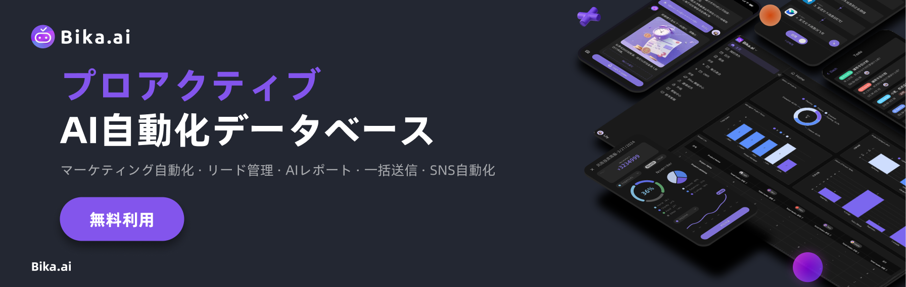

    

  <a href="README.md">English</a>
  | 
  <a href="docs/readme/readme_ZH.md">简体中文</a>
  | 
  <a href="docs/readme/readme_TW.md">繁體中文</a>
  | 
  日本語

# Bika.aiとは？ - 自発的AI自動化プラットフォーム入門ガイド

> この記事は自発的AI自動化プラットフォーム[Bika.ai](https://bika.ai) の入門ガイドです。
>
> [Bika.ai](https://bika.ai) はAI自動化アプリケーションの構築ツールで、毎日定時に各個人の仕事、プロセス報告、データ収集を支援します。
>
> あなたの仕事の時間を解放し、煩雑な仕事から解放され、より多くの時間を楽しむことができます。

## Bika.aiとは？

    

 

Bika.ai はビジネス AI エージェントプラットフォームで、ノーコード、マルチディメンショナルテーブル、データミドルウェア、企業向け AI 知識ベースを融合させ、AI に能動的に様々な仕事を行わせます。AI との繰り返しの対話は必要ありません。Bika.ai は繰り返し作業を自動化し、マーケティングや営業など、様々な職能においてシームレスに実行することができ、あなたに戦略的な仕事に集中することを可能にします。

従来のAIツールでは、あなたが積極的にAIと対話し、AIに仕事を手伝ってもらう必要があります。 しかし、Bika.aiは、AIが自発的にリマインダーやタスクを行う協働型AIエージェントであり、あなたがAIと対話する必要はなく、AIが定期的に自動化された形であなたやチームの仕事をサポートします。

### ユースケース

Bika.ai は以下のように使用できます：

- **マーケティング自動化**: メール、YouTube動画、Twitterツイート、通知SMSなどのマーケティングコンテンツを一括、定時、間隔で自動送信し、迅速かつ効率的なマーケティング自動化を実現します。
- **リード管理**: 数百万の営業リードを自動で収集、追跡、管理し、潜在顧客を体系的にフォローアップして、販売転換率を向上させます。
- **AIによるレポート**: 定期的にAI戦略と自動化プロセスを提案し、あなたの決定後に実行します。AIは定期的にレポートも生成します。
- **ワンストップソリューション**: 複雑な専門ソフトウェアは不要です。Bika.aiの軽量AI自動化データベースは、顧客データの保存、管理、追跡のニーズを満たします。
- **カスタム編集**: Bika.aiは強力なローコード/ノーコードエディターを提供し、さまざまな自動化タスクプロセスとデータシステムを簡単にカスタマイズでき、プロジェクト管理、製品ワークオーダー、注文管理などの多くのアプリケーションシナリオを実現します。

### ハイライト機能

- **AIメッセージとサマリー**: AIはあなたのデータとタスクに基づいてパーソナライズされたメッセージとサマリーレポートを生成します。
- **スマートタスク**: AIは自動的にタスクを作成し、割り当て、完了を判断します。手動のリマインダーは必要ありません。例えば、日々の会計、日記、チームタスク、朝会のエントリ、四半期ごとのOKRレビューなど
- **音声入力**: Bikaに話しかけると、あなたの声が構造化されたデータに変換されます。例えば、ひらめきのメモ、顧客訪問のエントリ、生活ジャーナル、チームCRMなど
- **スケジュールされた自動通知**: AIオートメーションがスケジュールされたリマインダーを自分自身または他人に送信します。例えば、週間会議のリマインダー、請求書の回収、家賃のリマインダー、顧客へのギフト、販売訪問、パフォーマンス追跡、ローテーション勤務の割り当てなど。

    

Bika.ai は日常のマーケティング業務の自動化に優れており、例えばソーシャルメディアコンテンツの一括投稿やメールの一括自動送信などが可能です。このツールを使えば、複雑な設定は過去のものとなります。

最も重要なのは、Bika.ai が真のプラグアンドプレイを実現しており、多くの既製テンプレートを提供しているため、3分以内にビジネスに適したAI自動化ワークフローを設定できることです。

    

 

Bika.ai のプロアクティブAI自動化は、日常のタスクを自動的に管理し、リマインダーや包括的なAIレポートを自動生成します。

手動入力なしで、チームに今後のタスクやプロジェクトの更新を通知し、何も見逃さないようにします。

常に一歩先を行くAIを使って、チームの生産性とプロジェクト管理を向上させましょう。

 

ほとんどの自動化ツールとは異なり、Bika.ai は設定した自動化を公開および共有することができ、チーム間のコラボレーションを容易に実現します。

効果的なプロジェクト管理の自動化を各部門に広め、運営効率を統一して向上させます。

このツールは透明性を高めるだけでなく、ワークフローを簡素化し、チームの効率を常態化させます。

 

AI自動化はデータ量を大幅に増加させますが、心配はいりません。Bika.ai のビッグデータ可視化データベースを使用すれば、数億行のデータを簡単に処理でき、API操作もサポートしています。

無限の顧客データを保存し、高度なダッシュボードチャートを利用して洞察に満ちたデータ駆動型の意思決定を行い、ビジネスを前進させましょう。

直感的な可視化ツールを活用して、データを簡単に深く掘り下げ、複雑な情報を一目で理解できるようにします。

 

 

## Bika.aiを始める：AI自動化のスタートガイド

    

 

Bika.aiの使い方を簡単に紹介します。3分以内でAI自動化の新しいスキルを習得し、今後の時間を解放しましょう。

1. 右上角でBika.aiアカウントを登録します。[こちらをクリック](https://bika.ai/signup)して登録します；
2. スペース画面の左側で、テンプレートセンターに入り、多数のプリセットされたAI自動化テンプレートを見つけます；
3. テンプレート「Slack チャンネル定期通知」を選択し、インストールします；
4. テンプレート内のSlack Incoming Webhooksの指示に従い、Slackアプリを作成し、対応するChannel Webhook URLを取得します；
5. 取得したChannel Webhook URLをコピーして、テンプレートのURL欄に貼り付けます；
6. 手動でトリガーをクリックし、Slackにメッセージが届くことを確認して、設定が完了します；
7. 必要に応じて、自動送信メッセージと送信時間を調整します；
8. 手動トリガーをもう一度クリックし、Slackの通知が正しく更新されていることを確認します；
9. 自動化の「スタート」スイッチをオンにして、AI自動化が完了しました。

次に、その原理について簡単に説明します。

 

## Bika.aiのユースケース

Bika.ai はビジネス AI エージェントプラットフォームで、AI エージェントによって駆動される CRM、マーケティング自動化システム、プロジェクト管理システム、ビジネスインテリジェンス（BI）、そして企業資源計画（ERP）を提供しています。これらすべてが驚くべき価格で提供されています。特に以下の人に最適です：

- マーケティング担当者
- KOLコンテンツクリエーター
- オートメーションコンサルタント
- プロジェクトマネージャー
- セールスマネージャー

以下は Bika.ai のさまざまな使用事例です：

### 📣 マーケティング

マーケターやインフルエンサーにとって、Bika.aiを使用して日々のマーケティング業務（例えば、ソーシャルメディアへの一括投稿）を自動化することは、影響力を飛躍的に高めるのに役立ちます。

### 💼 販売

営業では、わずか3分で一括メールの自動送信を設定して、簡単に顧客にリーチでき、ビッグデータビジュアルデータベースは数十億行をサポートし、必要なだけの顧客データを保存できます。

### 📋 プロジェクト管理

プロジェクトマネージャーにとって、プロアクティブAIオートメーションは、チームメンバーに今後のタスクを自動的にリマインドし、プロジェクトの状況に関する詳細なレポートを提供することで、複雑なプロジェクト管理でも整理された状態を確保します。

### 🏠 日常生活

日常生活を自動化する。

### 💰 ファイナンス

投資家や金融アナリストは、ホットストックニュースの集計テンプレートや自動株式データ取得テンプレートを使用することで、AI自動化を通じて意思決定プロセスを簡素化できます。

### 📁 運営

運用担当者は、採用プロセスや請求書管理などの主要なタスクを自動化することで、効率を大幅に向上させることができ、データ収集を簡素化し、処理を効率化します。

## Bika.aiの深部へ：AIが自動でタスクを完了する仕組みとは？

クイックスタートを読み終えたあと、Bika.aiの使用が非常にシンプルであることに気づくでしょう。対応するAIテンプレートを選択するだけで、さまざまなタスクを簡単に完了し、さらに調整してさらに多くのことを行うことができます。

    

 

ここでBika.aiのメインUIを開いて、その基本的なコンポーネントとその仕組みを詳しく見てみましょう。

 

### スペースステーション

スペースステーションは、Bika.aiに初めてアクセスしたときに表示されるインターフェースで、すべての作業内容を網羅しています。個人エリア、リソースエリア、探索エリア、展示エリア、個人設定、そしてスペースステーション管理で構成されています。

 

スペースステーションには複数のメンバーが存在し、各メンバーは専用の個人エリアを持ち、複数のリソースを設立できます。

### 個人エリア

個人エリアでは、自分専用のホームページ、タスク、レポートを確認できます。ホームページは、個人の仕事の概要を表示するものです。次に「私のタスク」と「レポート」を見てみましょう。

#### 知的タスク

Bika.aiでは、「知的タスク」は AIによって自動生成されたタスクメカニズムです。

タスクは、承認、アサインメント、リクエスト、レビュー、アラインメント、確認などの要素が混在したものです。

タスクを使って、ToDo リマインダー、他のユーザーに何かをさせる、データ収集、レポートレビュー、ワークフロー承認、AIが生成したドラフトの確認などを行うことができます。

 

Bika.aiのタスクは、一般的なToDoリストアプリのタスクとは異なることに注意が必要です。後者は ユーザーが手動で作成・完了するものです。

Bika.aiでは、タスクは通常AIやオートメーションによって生成され、完了状況も自動的に判断されます。

例えば、「毎日の売上報告」のシナリオでは、AIが各営業メンバーにスマートタスクを自動生成します。メンバーがデータ入力を完了し、AIによってチェックされると、タスクは自動的に完了します。

#### レポート

レポートは、設定されたルールやデータに基づいてAIや自動化によって集約され生成されます。メールや記事のようなものです。

 

### リソースエリア

テンプレートをインストールする際に気づくでしょうが、テンプレートは複数のリソースで構成されています。以下の「AI 自動投稿 X ツイート」テンプレートは、2つのリソースで構成されています：

- 自動化リソース：ツイートのスケジュール
- データベースリソース：X ツイートの内容

 

### 探索エリア

探索エリアでは、Bikaのさまざまな可能性を拡張するのに便利です。テンプレートセンター、メンバーの招待、アップグレード、カスタマーサービスへの連絡、ヘルプとサポートが含まれています。テンプレートセンターでは、豊富なAI自動化テンプレートを提供しており、仕事の問題を迅速に解決できます。

 

### 展示エリア

ここでは、タスク、レポート、リソースノードを展示および編集することができます。作業内容を理解し、管理するのに便利です。

 

### 個人設定

左下のアバターをクリック -> 個人設定で、個人情報、アカウントの連携とセキュリティ、通知設定、ログイン記録、開発者API、および推奨報酬ポイントを確認できます。

 

### スペースステーション管理

左上のスペースステーション -> 歯車アイコンをクリックすると、スペースステーションの管理と設定が行えます。スペースステーションの設定、メンバーの招待、メンバー管理、ロール管理、サードパーティ統合、有料アップグレード、使用量&請求、スペースステーション監査などが含まれます。

 

    

 

## 機能について

### 言語

Bika.ai は以下のシステム言語をサポートしています

- 英語
- 簡体字
- 繁体字
- 日本語

システム言語だけでなく、データアプリにはデータベース、フィールド、自動化なども含まれており、複数の言語をサポートしています。 これは、ユーザーの地域に応じて複数の言語をサポートするカスタムAIデータ自動化アプリを構築できることを意味します。

### ノードリソース

ノードリソースは、データベース、自動化、フォームなどのノード実装の一種です。

### 自動化タスク - トリガー

自動化トリガーは、特定の条件が満たされたときに自動化を開始する「スイッチ」として機能します。 トリガーは次のように考えることができます：特定のイベント（トリガー）が発生し、特定の条件が真である場合、結果のイベント（アクション）が実行されます。

### 自動化タスク - アクション

自動化アクションとは、メールの送信などのタスク、活動、イベント、または変更を実行するステップを指します。 アクションは次のように考えることができます：何か（トリガー）が発生し、指定された条件が満たされた場合、このイベント（アクション）が実行されます。

### ミッション

ミッションはスマートで自動化され、追跡可能なタスクであり、典型的なタスクや自分でチェックオフしなければならない To-Do リストとは異なります。たとえば、「レコード作成ミッション」を考えてみましょう。ユーザーがこれを受け取ったとき、必要なレコードが作成されたときにのみ、ミッションは自動的に完了としてマークされます。

### データテーブル - ビュー

データベースビューは、データベーステーブルの基礎となるデータを視覚化および整理する特定の方法を提供します。 標準的なビューはグリッドですが、フォーム、カレンダー、ギャラリー、かんばんレイアウトなどの他の形式も含まれます。 1つのデータベースで複数のビューとさまざまな種類のビューをサポートできます。

### データテーブル - フィールド

データベースフィールドは、データベーステーブルの各レコードの詳細やメタデータを含みます。 データベースフィールドは、データベーステーブルの各エントリの情報やメタデータを保持します。これらのフィールドはさまざまな形式を取ることができ、テキスト、単一または複数の選択肢、画像、チェックボックス、数値、ユーザータグなどとしてデータを保存できます。

### ダッシュボード - ウィジェット

ウィジェットは、データベース、ビュー、フォーム、ダッシュボードなどのリソースに関連する情報を表示するための小さなアプリケーションです。ウィジェットは、データの要約、分析、および可視化をサポートし、データの理解と意思決定を促進します。ウィジェットは、テキスト、数値、グラフ、チャート、カレンダー、リストなど、さまざまなデータ表示形式をサポートしており、さまざまなデータ分析ニーズに対応します。

### 連携センター

連携は、Bika.aiと外部サービスやアプリケーションとの接続であり、両プラットフォーム間でのシームレスなデータ転送を可能にします。 選択する連携は、データで解決したい特定の問題によって異なります。 例えば、タスクを追跡するデータベースレコードがあり、要約のためにAIを活用したい場合、OpenAI連携を利用してデータをOpenAIに送信し、返された情報を使用してメールを送信することができます。

### 製品比較

Bika.ai は Airtable（データベース）と Zapier（自動化）を組み合わせた簡単で使いやすいプラットフォームで、AIエージェント強化のCRM、マーケティング自動化システム、プロジェクト管理システム、ビジネスインテリジェンス（BI）およびエンタープライズリソースプランニング（ERP）を提供します。これらすべてを驚くほどの価格で提供します。

- [airtable](https://airtable.com/): Airtableと比較して、Bika.aiはAI自動化と積極的なサポートにより重点を置いています。Bika.aiは、仕事や生活でより多くの自動化とAIの支援を必要とするユーザーに適しています。
- [zapier](https://zapier.com/): Zapierと比較して、Bika.aiはプラグアンドプレイのテンプレートとデータベースワークフローにより重点を置いています。Bika.aiは、仕事や生活でより多くの自動化とAIの支援を必要とするユーザーに適しています。
- [make](https://www.make.com/): Make と比較すると、Bika.ai はより統合された AI 駆動型ソリューションと積極的な自動化をプラットフォーム内で直接提供します。Bika.ai は、高度な AI 機能による深い自動化を求め、複雑なワークフローとデータ管理タスクを効率化したいユーザーに最適です。

### 高度な機能について

全体として、Bika.aiは個人から企業まで適用可能な、AIが主体的に自動化を行う新しい機能を一連提供しています。

- スペースステーション：個人またはチームの作業スペースで、各メンバーは複数のタスク、レポート、リソース、AIエージェントなどを持つことができます；
- リソース：AIが自動操作可能なオブジェクトで、以下を含む：
  - 自動化プロセス：定時またはイベントトリガーで自動的に特定の作業を完了する
  - データシート：多次元グリッドやデータベースの表と同様の、構造化されたテーブルで、10億行以上のデータをサポート
  - ビュー: データシート内のビュー（グリッドビュー、ギャラリービュー、マインドマップビュー、カンバンビュー、フル機能グリッドビュー、カレンダービューなど）をリソース内で独立して扱う；
- タスク：一般的な「個人タスク」とは異なり、AIが自動的に生成し、完了を自動で判断するタスク;
- レポート：自動化またはAIによって集約され、生成される文書報告；
- データシート：
  - `大規模データ量`: 10億行を超える多次元グリッドで、大量データのチャート生成やAIデータトレーニングをサポート；
  - `豊富なAPI`: `データ(Data)`から`メタデータ(Metadata)`への全スタックOpenAPIアクセスを提供し、Bika.aiをPostgresSQL、MySQLなどのビジネスデータベースとして使用；
  - `リンク`: 単方向/双方向テーブルリンクおよび`無限クロスリンク`
  - `CRUD操作`: テーブル、列、行の作成、閲覧、更新、削除
  - `AI検索`: データ表、ビュー、ナレッジベースを対象に、AI検索とQ&Aを行い、生産性ナレッジベースとする。
  - `カスタマイズツールバー`: 各ユーザーがデータシートツールバーで行うフィルタリング、グルーピングなどの操作は独立しており、他のユーザーに影響を与えない
  - `フィールド操作`: ソート、フィルタリング、グルーピング、表示/非表示、高さの設定。
  - `スペースベース`: アプリ/ベース構造に代わる分離された作業スペースを使用し、無限のテーブル接続を可能にする。
  - `ダークモード`およびテーマカスタマイズ。
  - `7種類のビュータイプ`: データシートビュー/ギャラリービュー/マインドマップビュー/カンバンビュー/フル機能グリッドビュー/カレンダービュー
- テンプレート： 本当のワンストップテンプレートで、自動化、サードパーティ統合、データシート、組織ロールを一つにまとめ、ワンクリックでインストール、使用可能；
  - テンプレートのアップグレード: インストール後に公式のアップグレードを追従するか、自身で軽量の調整を行う
  - テンプレートの公開: ワンストップ、フルスタックのテンプレートを外部に公開し、外部でテンプレートを販売することも可能で、知的財産権を保護し、インストール後もコントロールを失わない；
- 個人とチーム、企業レベルの構造管理：
- 多言語：デフォルトで日本語、英語、簡体字中国語、繁体字中国語をサポートし、国際的なチーム協力をシームレスにサポート、その他の言語も追加可能；
- 企業レベルの権限
  - 権限：個人、チーム、企業レベルの権限をサポートし、個人の部分的な権限、行権限、列権限、フォルダ権限などをサポート；
  - 独立リソース`ビュー`、ビューをミラー化してより高度な権限の分離を実現；
  - `列権限`を非常にシンプルな操作で有効化
  - フォルダ/サブフォルダ/ファイル権限
  - ツリー構造フォルダーとカスタマイズ可能なリソース（ノードファイル）
  - チーム管理 & 組織構造
  - ホワイトレーベルとセルフホスティングをサポートしています
- 将来のさらなる機能
  - AI音声：完全な知能
  - AI作成：
  - Terraformリソース管理
  - n8n.io / Zapier / make.com / Appsmithなどの統合
  - シングルサインオン（SSO）/SAMLなどの認証
  - カスタム拡張機能とプラグイン
  - 監査
  - データベースの自動バックアップ/エクスポート
  - セキュリティウォーターマーク
  - Slack/WhatsApp/Teams/Telegram/钉钉/企業微信/飞书の統合
- ....

## 完全無料試用

    

 

現在、Bika.aiは完全に無料で使用でき、しかも使用量は非常に寛大です。無料プランの詳細については[料金表](https://bika.ai/pricing)をご覧ください。

何かアイデアがあれば、ぜひコミュニティに参加してフィードバックや提案をしてください： https://bika.ai/contact。

もしさらに高度な機能が必要であれば、例えばプライベートデプロイや機能のスケジュールなど、高級管理者にご連絡ください：[お問い合わせ](https://bika.ai/ja/blog/what-is-bika-ai?m=eyJuYW1lIjoiQ09OVEFDVF9TRVJWSUNFIn0=)。

 

## よくある質問: Bika.aiとは？

### 一言で説明：Bika.aiとは何ですか？
Bika.aiはAI自動化ツールであり、表形式のデータベースとAI技術を組み合わせて、データ管理とタスク処理を自動化し、作業プロセスの効率を向上させます。

 

### Bika.aiは何がそんなにユニークなのですか？

Bika.aiは開封即使用の自動化データベースを提供し、豊富な機能とサードパーティ統合が内蔵されています。データ量がどれだけ多くても、数十億のデータであっても、Bika.aiは容易に対応できます。Bika.aiを使用すると、AIと絶え間なく対話する必要はなく、データ量ももはや問題ではありません。

Bika.aiを通じてタスクを自動で完了させることで、作業はより効率的かつ正確になり、大量の時間を節約できます。ユーザーは自動化テンプレートを簡単に公開、共有、複製することができ、持続的な改善を容易にします。マーケティング、セールス、プロジェクト管理をよりシンプルにし、AIオートメーションを通じてデータ処理能力を向上させたい場合、Bika.aiはあなたの理想的な選択です。

 

### "BIKA" という略語は何を意味しますか？
B-I-K-Aは「ビジネスインテリジェンスと知識自動化（Business Intelligence and Knowledge Automation）」の略です。ビジネスインテリジェンス、知識自動化、AIを組み合わせています。

 

### Bika.aiはどのようにしてAI自動化を実現していますか？
Bika.aiの出発点は「チャットボックス」ではなく「自動化」で、定時や新規データ追加などのトリガー条件を設定してAI自動化を実行します。 実際に、Bika.aiは「AI自動化ツール」であり、大規模AIモデルに依存せず、自動化機能を使用しているため、AI推論コストは発生しません。Bika.aiのタスク、集約、リソースなどのコアコンポーネントを通じて、多くの作業を効果的に完了させ、時間を節約し、より多くの時間を楽しむことができます。 直接[テンプレートセンター](https://bika.ai/en/template) にアクセスして、適切なソリューションを見つけてください。

 

### Bika.AIは無料で使用できますか？
はい、現在Bika.AIは完全に無料で利用できます。非常に寛大な使用量が許可されています。無料スペックを参照してください。 無料枠を超えた場合や、カスタマイズ機能やプライベートデプロイメントなど、より多くのサービスを希望する場合は、[営業担当者に連絡](https://bika.ai/en/blog/what-is-bika-ai?contact=1)してください。.

 

### Bika.aiとChatGPT、GeminiなどのAIアシスタントとの違いは何ですか？
ChatGPT、Gemini、ClaudeなどのAIアシスタントは、大規模なモデルに基づくAIチャットアシスタントで、大量のAI推論コストがかかります。 一方、Bika.aiはAI自動化、データベースツールで、タスクを自動的に完了します。 これらは完全に異なる製品であり、[AI自動化テンプレートセンター](https://bika.ai/ja/template)をチェックして、日常のニーズに合ったテンプレートがあるかどうかを確認してください。

 

### Bika.aiと多次元スプレッドシートの違いは何ですか？
市場には多次元スプレッドシートの優れたツールが多数あります、例えば[vika維格雲](https://vika.cn/)や[Airtable](https://airtable.com/)などです。 確かにBika.aiと多次元スプレッドシートのコアは似ています：表形式のデータベース、自動化などです。 多次元スプレッドシートは協力に優れていますが、Bika.aiは「タスク」、「報告」、「AI自動化」を重視し、表ではなく、AIを利用してデータを活用するAI自動化ツールです。

 

### Bika.aiでは、単一のテーブルのデータ量が数万行、数十万行に達し、関連参照が増えた場合、動作が遅くなりますか?
いいえ、遅くなりません。Bika.aiのデータテーブルは、巨大なデータ量を想定して設計されています。基盤ではOLTPビジネスデータベース、OLAPアナリティクスデータベース、NoSQL データベース、時系列データベース、インデックスデータベース、ベクトルデータベースなどの技術を組み合わせて使用しており、1000万件、1億件規模のデータ量でも、プロセスと高パフォーマンスを維持できるよう設計されています。

 

### Bika.AIの「スペースステーション」とは何ですか？
「スペースステーション」は、組織またはチームの全メンバーが協力するプラットフォームです。Bika.aiのワークスペース左上にあるスペースアイコンをクリックすることで、パーソナライズされた管理と招待されたスペースにアクセスできます。

 

### 支払い後、いくつの有料スペースを持っていますか？
Bika.ai はスペースサブスクリプションモデルを採用しています。サブスクリプションを購入すると、1つのスペースが得られます。所有しているスペースの数は、購入したサブスクリプションの数に等しいです。各スペースには、購入条件で規定された特定の使用権が含まれています。

 

### 「リソース」とは何ですか？
「リソース」とは、スペースのリソース部分の左側のディレクトリツリー内のファイルノードを指します。これには、自動化、データベース、フォーム、ダッシュボードなどが含まれます。 削除されたリソースはカウントに含まれません。新しいデータベースと新しいフォームを作成すると、カウントに2つのファイルノードが追加されます。そのうちの1つを削除すると、カウントが1減少します。

 

### Bika.aiのチームはどのように「自社の製品を自ら使っている」のですか?
素晴らしい質問ですね。私たち自身もBika.aiを熱心に使用しています。 内部では、Bika.aiを以下のように活用しています:毎日の朝会の通知/収集/まとめ、週次Scrumの作業サイクルの通知/収集/まとめ、Twitterの公式アカウントの記事の承認と投稿のスケジュール管理、日次の販売データ分析レポートの生成、機能要求とバグのAI自動化管理、定期的なマーケティングメールの配信など、可能な限り定型的で日常的な作業をAI自動化しています。 Bika.aiチームは3つのSaaSプラットフォーム製品、30以上のデプロイ、百万人のユーザー、数万のチームカスタマーを運営しており、自社の反復作業を削減するためにもっとAI自動化ツールが必要だったので、Bika.aiを開発したのです。 私たちはお客様にもBika.aiを「使って去る」形で使っていただきたいと考えています。つまり、ソフトウェアに入って初期設定をした後は、大半の作業をAIに任せられるようにしたいのです。

 

### Bika.aiはどのようにして作業効率を向上させますか？
Bika.aiは強力な自動化機能を通じて、ユーザーが日常のタスクを自動的に実行するのを支援します。ユーザーは自分のニーズに応じて自動化タスクを設定できます。データ更新の通知、タスクスケジューリング、自動レポート生成などがこれに含まれます。これにより、手動操作を減らし効率を向上させることができます。適切なソリューションを見つけるために、[テンプレートセンター](https://bika.ai/ja/template)を直接訪問してください。

 

### Bika.aiのAI自動化機能にはどのような特徴がありますか？
Bika.aiのAI自動化機能は、特定の条件を満たした時に自動的にトリガーされる条件ベースのタスクを作成することができます。たとえば、データテーブルが新しいデータを受信すると、Bika.aiはデータの処理と分析を自動的に行い、関連する人々に通知を送ることができます。[テンプレートセンター](https://bika.ai/ja/template)を直接訪問して体験してみてください。

 

### Bika.aiの自動化テンプレートとは何ですか？
自動化テンプレートは、事前に設定されたタスクフローです。ユーザーはこれらのテンプレートを直接適用して特定のワークフローを自動化することができます。これらのテンプレートは、データ入力から複雑なデータ処理までの様々な一般的なシナリオをカバーしており、ユーザーが迅速にAI技術を展開して活用するのに役立ちます。[テンプレートセンター](https://bika.ai/ja/template)を直接訪問して使用してみてください。

 

### Bika.aiはチーム協力と権限機能をサポートしていますか？
はい、Bika.aiは「スペースステーション」という機能を提供しています。これは、チーム内のメンバーがリソースを共有し、データを管理し、協力して作業するためのプラットフォームです。また、外部のチームや個人との協力も良好にサポートします。スペースステーションはパーソナライズ設定と権限管理をサポートし、チームメンバーが効率的に協力できるようにします。

    

